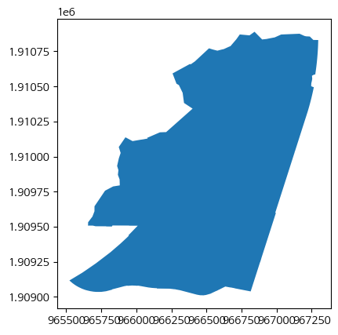
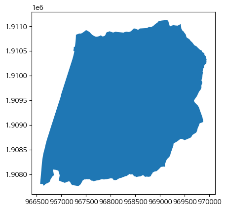
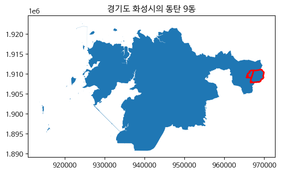
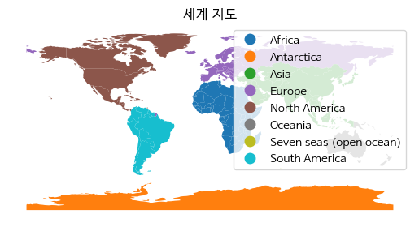

```python
"""
----
layout:single
title:"지역별인구파악"
---
"""
```


    '\n----\nlayout:single\ntitle:"지역별인구파악"\n---\n'


## 원시 데이터를 읽어온다.


```python
import pandas as pd
df = pd.read_csv("행정안전부_지역별(행정동) 성별 연령별 주민등록 인구수_20231031.csv", encoding="cp949")
```

## 데이터 확인


```python
df
```


<div>
<style scoped>
    .dataframe tbody tr th:only-of-type {
        vertical-align: middle;
    }

    .dataframe tbody tr th {
        vertical-align: top;
    }

    .dataframe thead th {
        text-align: right;
    }
</style>
<table border="1" class="dataframe">
  <thead>
    <tr style="text-align: right;">
      <th></th>
      <th>행정기관코드</th>
      <th>기준연월</th>
      <th>시도명</th>
      <th>시군구명</th>
      <th>읍면동명</th>
      <th>계</th>
      <th>남자</th>
      <th>여자</th>
      <th>만0세남자</th>
      <th>만1세남자</th>
      <th>...</th>
      <th>만101세여자</th>
      <th>만102세여자</th>
      <th>만103세여자</th>
      <th>만104세여자</th>
      <th>만105세여자</th>
      <th>만106세여자</th>
      <th>만107세여자</th>
      <th>만108세여자</th>
      <th>만109세여자</th>
      <th>만110세이상여자</th>
    </tr>
  </thead>
  <tbody>
    <tr>
      <th>0</th>
      <td>1111051500</td>
      <td>2023-10-31</td>
      <td>서울특별시</td>
      <td>종로구</td>
      <td>청운효자동</td>
      <td>11345</td>
      <td>5181</td>
      <td>6164</td>
      <td>21</td>
      <td>21</td>
      <td>...</td>
      <td>1</td>
      <td>1</td>
      <td>0</td>
      <td>0</td>
      <td>0</td>
      <td>0</td>
      <td>0</td>
      <td>0</td>
      <td>0</td>
      <td>0</td>
    </tr>
    <tr>
      <th>1</th>
      <td>1111053000</td>
      <td>2023-10-31</td>
      <td>서울특별시</td>
      <td>종로구</td>
      <td>사직동</td>
      <td>9016</td>
      <td>4005</td>
      <td>5011</td>
      <td>12</td>
      <td>15</td>
      <td>...</td>
      <td>0</td>
      <td>0</td>
      <td>0</td>
      <td>0</td>
      <td>0</td>
      <td>0</td>
      <td>0</td>
      <td>0</td>
      <td>0</td>
      <td>0</td>
    </tr>
    <tr>
      <th>2</th>
      <td>1111054000</td>
      <td>2023-10-31</td>
      <td>서울특별시</td>
      <td>종로구</td>
      <td>삼청동</td>
      <td>2246</td>
      <td>1073</td>
      <td>1173</td>
      <td>3</td>
      <td>2</td>
      <td>...</td>
      <td>1</td>
      <td>0</td>
      <td>0</td>
      <td>0</td>
      <td>0</td>
      <td>0</td>
      <td>0</td>
      <td>0</td>
      <td>0</td>
      <td>0</td>
    </tr>
    <tr>
      <th>3</th>
      <td>1111055000</td>
      <td>2023-10-31</td>
      <td>서울특별시</td>
      <td>종로구</td>
      <td>부암동</td>
      <td>9125</td>
      <td>4319</td>
      <td>4806</td>
      <td>9</td>
      <td>10</td>
      <td>...</td>
      <td>2</td>
      <td>1</td>
      <td>1</td>
      <td>0</td>
      <td>0</td>
      <td>0</td>
      <td>0</td>
      <td>0</td>
      <td>0</td>
      <td>0</td>
    </tr>
    <tr>
      <th>4</th>
      <td>1111056000</td>
      <td>2023-10-31</td>
      <td>서울특별시</td>
      <td>종로구</td>
      <td>평창동</td>
      <td>17415</td>
      <td>8107</td>
      <td>9308</td>
      <td>33</td>
      <td>43</td>
      <td>...</td>
      <td>4</td>
      <td>0</td>
      <td>0</td>
      <td>1</td>
      <td>0</td>
      <td>0</td>
      <td>0</td>
      <td>0</td>
      <td>1</td>
      <td>0</td>
    </tr>
    <tr>
      <th>...</th>
      <td>...</td>
      <td>...</td>
      <td>...</td>
      <td>...</td>
      <td>...</td>
      <td>...</td>
      <td>...</td>
      <td>...</td>
      <td>...</td>
      <td>...</td>
      <td>...</td>
      <td>...</td>
      <td>...</td>
      <td>...</td>
      <td>...</td>
      <td>...</td>
      <td>...</td>
      <td>...</td>
      <td>...</td>
      <td>...</td>
      <td>...</td>
    </tr>
    <tr>
      <th>3580</th>
      <td>5183031000</td>
      <td>2023-10-31</td>
      <td>강원특별자치도</td>
      <td>양양군</td>
      <td>서면</td>
      <td>2711</td>
      <td>1403</td>
      <td>1308</td>
      <td>1</td>
      <td>0</td>
      <td>...</td>
      <td>1</td>
      <td>0</td>
      <td>0</td>
      <td>0</td>
      <td>0</td>
      <td>0</td>
      <td>0</td>
      <td>0</td>
      <td>0</td>
      <td>0</td>
    </tr>
    <tr>
      <th>3581</th>
      <td>5183032000</td>
      <td>2023-10-31</td>
      <td>강원특별자치도</td>
      <td>양양군</td>
      <td>손양면</td>
      <td>2295</td>
      <td>1148</td>
      <td>1147</td>
      <td>1</td>
      <td>2</td>
      <td>...</td>
      <td>0</td>
      <td>0</td>
      <td>0</td>
      <td>1</td>
      <td>0</td>
      <td>0</td>
      <td>0</td>
      <td>0</td>
      <td>0</td>
      <td>0</td>
    </tr>
    <tr>
      <th>3582</th>
      <td>5183033000</td>
      <td>2023-10-31</td>
      <td>강원특별자치도</td>
      <td>양양군</td>
      <td>현북면</td>
      <td>2616</td>
      <td>1384</td>
      <td>1232</td>
      <td>4</td>
      <td>3</td>
      <td>...</td>
      <td>1</td>
      <td>0</td>
      <td>1</td>
      <td>0</td>
      <td>0</td>
      <td>0</td>
      <td>1</td>
      <td>0</td>
      <td>0</td>
      <td>0</td>
    </tr>
    <tr>
      <th>3583</th>
      <td>5183034000</td>
      <td>2023-10-31</td>
      <td>강원특별자치도</td>
      <td>양양군</td>
      <td>현남면</td>
      <td>3010</td>
      <td>1584</td>
      <td>1426</td>
      <td>1</td>
      <td>1</td>
      <td>...</td>
      <td>0</td>
      <td>0</td>
      <td>0</td>
      <td>0</td>
      <td>0</td>
      <td>0</td>
      <td>0</td>
      <td>0</td>
      <td>0</td>
      <td>0</td>
    </tr>
    <tr>
      <th>3584</th>
      <td>5183035000</td>
      <td>2023-10-31</td>
      <td>강원특별자치도</td>
      <td>양양군</td>
      <td>강현면</td>
      <td>4594</td>
      <td>2360</td>
      <td>2234</td>
      <td>7</td>
      <td>3</td>
      <td>...</td>
      <td>1</td>
      <td>0</td>
      <td>0</td>
      <td>0</td>
      <td>0</td>
      <td>0</td>
      <td>0</td>
      <td>0</td>
      <td>0</td>
      <td>0</td>
    </tr>
  </tbody>
</table>
<p>3585 rows × 230 columns</p>
</div>


## 필요한 컬럼만 선별하여 별도의 데이터프레임 생성


```python
filter = df[["시도명","시군구명","읍면동명","계","남자","여자"]]
filter
```


<div>
<style scoped>
    .dataframe tbody tr th:only-of-type {
        vertical-align: middle;
    }

    .dataframe tbody tr th {
        vertical-align: top;
    }

    .dataframe thead th {
        text-align: right;
    }
</style>
<table border="1" class="dataframe">
  <thead>
    <tr style="text-align: right;">
      <th></th>
      <th>시도명</th>
      <th>시군구명</th>
      <th>읍면동명</th>
      <th>계</th>
      <th>남자</th>
      <th>여자</th>
    </tr>
  </thead>
  <tbody>
    <tr>
      <th>0</th>
      <td>서울특별시</td>
      <td>종로구</td>
      <td>청운효자동</td>
      <td>11345</td>
      <td>5181</td>
      <td>6164</td>
    </tr>
    <tr>
      <th>1</th>
      <td>서울특별시</td>
      <td>종로구</td>
      <td>사직동</td>
      <td>9016</td>
      <td>4005</td>
      <td>5011</td>
    </tr>
    <tr>
      <th>2</th>
      <td>서울특별시</td>
      <td>종로구</td>
      <td>삼청동</td>
      <td>2246</td>
      <td>1073</td>
      <td>1173</td>
    </tr>
    <tr>
      <th>3</th>
      <td>서울특별시</td>
      <td>종로구</td>
      <td>부암동</td>
      <td>9125</td>
      <td>4319</td>
      <td>4806</td>
    </tr>
    <tr>
      <th>4</th>
      <td>서울특별시</td>
      <td>종로구</td>
      <td>평창동</td>
      <td>17415</td>
      <td>8107</td>
      <td>9308</td>
    </tr>
    <tr>
      <th>...</th>
      <td>...</td>
      <td>...</td>
      <td>...</td>
      <td>...</td>
      <td>...</td>
      <td>...</td>
    </tr>
    <tr>
      <th>3580</th>
      <td>강원특별자치도</td>
      <td>양양군</td>
      <td>서면</td>
      <td>2711</td>
      <td>1403</td>
      <td>1308</td>
    </tr>
    <tr>
      <th>3581</th>
      <td>강원특별자치도</td>
      <td>양양군</td>
      <td>손양면</td>
      <td>2295</td>
      <td>1148</td>
      <td>1147</td>
    </tr>
    <tr>
      <th>3582</th>
      <td>강원특별자치도</td>
      <td>양양군</td>
      <td>현북면</td>
      <td>2616</td>
      <td>1384</td>
      <td>1232</td>
    </tr>
    <tr>
      <th>3583</th>
      <td>강원특별자치도</td>
      <td>양양군</td>
      <td>현남면</td>
      <td>3010</td>
      <td>1584</td>
      <td>1426</td>
    </tr>
    <tr>
      <th>3584</th>
      <td>강원특별자치도</td>
      <td>양양군</td>
      <td>강현면</td>
      <td>4594</td>
      <td>2360</td>
      <td>2234</td>
    </tr>
  </tbody>
</table>
<p>3585 rows × 6 columns</p>
</div>


## 선별된 데이터 내에서 화성시만 별도로 인구수 높은 순으로 정렬
### 동탄은 별도의 이름으로 매핑
### 그외의 지역은 화성으로 매핑


```python
filter_df = filter[filter["시군구명"] == "화성시"].sort_values(by="계", ascending=False)
filter_df

# 읍면동명과 동탄신도시 이름을 매핑
mapping = {    
    "동탄1동": "동탄1신도시",
    "동탄2동": "동탄1신도시",
    "동탄3동": "동탄1신도시",
    "동탄4동": "동탄2신도시",
    "동탄5동": "동탄2신도시",
    "동탄6동": "동탄2신도시",
    "동탄7동": "동탄2신도시",
    "동탄8동": "동탄2신도시",
    "동탄9동": "동탄2신도시"
}

filter_df['권역별타입'] = filter_df['읍면동명'].map(mapping)
filter_df.loc[filter_df["권역별타입"].isna(), "권역별타입"] = "화성"

filter_df["남자_비율"] = filter_df["남자"] / filter_df["계"] * 100
filter_df["여자_비율"] = filter_df["여자"] / filter_df["계"] * 100

filter_df["비율차이"] = filter_df["남자_비율"] - filter_df["여자_비율"]

filter_df
```


<div>
<style scoped>
    .dataframe tbody tr th:only-of-type {
        vertical-align: middle;
    }

    .dataframe tbody tr th {
        vertical-align: top;
    }

    .dataframe thead th {
        text-align: right;
    }
</style>
<table border="1" class="dataframe">
  <thead>
    <tr style="text-align: right;">
      <th></th>
      <th>시도명</th>
      <th>시군구명</th>
      <th>읍면동명</th>
      <th>계</th>
      <th>남자</th>
      <th>여자</th>
      <th>권역별타입</th>
      <th>남자_비율</th>
      <th>여자_비율</th>
      <th>비율차이</th>
    </tr>
  </thead>
  <tbody>
    <tr>
      <th>1663</th>
      <td>경기도</td>
      <td>화성시</td>
      <td>봉담읍</td>
      <td>92823</td>
      <td>46958</td>
      <td>45865</td>
      <td>화성</td>
      <td>50.588755</td>
      <td>49.411245</td>
      <td>1.177510</td>
    </tr>
    <tr>
      <th>1665</th>
      <td>경기도</td>
      <td>화성시</td>
      <td>향남읍</td>
      <td>85647</td>
      <td>46002</td>
      <td>39645</td>
      <td>화성</td>
      <td>53.711163</td>
      <td>46.288837</td>
      <td>7.422327</td>
    </tr>
    <tr>
      <th>1689</th>
      <td>경기도</td>
      <td>화성시</td>
      <td>동탄7동</td>
      <td>56758</td>
      <td>28533</td>
      <td>28225</td>
      <td>동탄2신도시</td>
      <td>50.271327</td>
      <td>49.728673</td>
      <td>0.542655</td>
    </tr>
    <tr>
      <th>1666</th>
      <td>경기도</td>
      <td>화성시</td>
      <td>남양읍</td>
      <td>55133</td>
      <td>29923</td>
      <td>25210</td>
      <td>화성</td>
      <td>54.274210</td>
      <td>45.725790</td>
      <td>8.548419</td>
    </tr>
    <tr>
      <th>1686</th>
      <td>경기도</td>
      <td>화성시</td>
      <td>동탄4동</td>
      <td>53389</td>
      <td>26533</td>
      <td>26856</td>
      <td>동탄2신도시</td>
      <td>49.697503</td>
      <td>50.302497</td>
      <td>-0.604994</td>
    </tr>
    <tr>
      <th>1677</th>
      <td>경기도</td>
      <td>화성시</td>
      <td>진안동</td>
      <td>50485</td>
      <td>27402</td>
      <td>23083</td>
      <td>화성</td>
      <td>54.277508</td>
      <td>45.722492</td>
      <td>8.555016</td>
    </tr>
    <tr>
      <th>1683</th>
      <td>경기도</td>
      <td>화성시</td>
      <td>동탄1동</td>
      <td>50476</td>
      <td>26093</td>
      <td>24383</td>
      <td>동탄1신도시</td>
      <td>51.693874</td>
      <td>48.306126</td>
      <td>3.387749</td>
    </tr>
    <tr>
      <th>1687</th>
      <td>경기도</td>
      <td>화성시</td>
      <td>동탄5동</td>
      <td>46746</td>
      <td>23503</td>
      <td>23243</td>
      <td>동탄2신도시</td>
      <td>50.278099</td>
      <td>49.721901</td>
      <td>0.556197</td>
    </tr>
    <tr>
      <th>1688</th>
      <td>경기도</td>
      <td>화성시</td>
      <td>동탄6동</td>
      <td>43247</td>
      <td>22242</td>
      <td>21005</td>
      <td>동탄2신도시</td>
      <td>51.430157</td>
      <td>48.569843</td>
      <td>2.860314</td>
    </tr>
    <tr>
      <th>1685</th>
      <td>경기도</td>
      <td>화성시</td>
      <td>동탄3동</td>
      <td>40912</td>
      <td>21074</td>
      <td>19838</td>
      <td>동탄1신도시</td>
      <td>51.510559</td>
      <td>48.489441</td>
      <td>3.021118</td>
    </tr>
    <tr>
      <th>1691</th>
      <td>경기도</td>
      <td>화성시</td>
      <td>동탄9동</td>
      <td>39155</td>
      <td>19661</td>
      <td>19494</td>
      <td>동탄2신도시</td>
      <td>50.213255</td>
      <td>49.786745</td>
      <td>0.426510</td>
    </tr>
    <tr>
      <th>1680</th>
      <td>경기도</td>
      <td>화성시</td>
      <td>반월동</td>
      <td>37284</td>
      <td>18882</td>
      <td>18402</td>
      <td>화성</td>
      <td>50.643708</td>
      <td>49.356292</td>
      <td>1.287416</td>
    </tr>
    <tr>
      <th>1678</th>
      <td>경기도</td>
      <td>화성시</td>
      <td>병점1동</td>
      <td>36539</td>
      <td>18779</td>
      <td>17760</td>
      <td>화성</td>
      <td>51.394401</td>
      <td>48.605599</td>
      <td>2.788801</td>
    </tr>
    <tr>
      <th>1684</th>
      <td>경기도</td>
      <td>화성시</td>
      <td>동탄2동</td>
      <td>34380</td>
      <td>16874</td>
      <td>17506</td>
      <td>동탄1신도시</td>
      <td>49.080861</td>
      <td>50.919139</td>
      <td>-1.838278</td>
    </tr>
    <tr>
      <th>1690</th>
      <td>경기도</td>
      <td>화성시</td>
      <td>동탄8동</td>
      <td>33572</td>
      <td>16881</td>
      <td>16691</td>
      <td>동탄2신도시</td>
      <td>50.282974</td>
      <td>49.717026</td>
      <td>0.565948</td>
    </tr>
    <tr>
      <th>1682</th>
      <td>경기도</td>
      <td>화성시</td>
      <td>화산동</td>
      <td>27157</td>
      <td>14365</td>
      <td>12792</td>
      <td>화성</td>
      <td>52.896123</td>
      <td>47.103877</td>
      <td>5.792245</td>
    </tr>
    <tr>
      <th>1676</th>
      <td>경기도</td>
      <td>화성시</td>
      <td>새솔동</td>
      <td>25563</td>
      <td>12813</td>
      <td>12750</td>
      <td>화성</td>
      <td>50.123225</td>
      <td>49.876775</td>
      <td>0.246450</td>
    </tr>
    <tr>
      <th>1679</th>
      <td>경기도</td>
      <td>화성시</td>
      <td>병점2동</td>
      <td>23006</td>
      <td>11203</td>
      <td>11803</td>
      <td>화성</td>
      <td>48.695992</td>
      <td>51.304008</td>
      <td>-2.608015</td>
    </tr>
    <tr>
      <th>1664</th>
      <td>경기도</td>
      <td>화성시</td>
      <td>우정읍</td>
      <td>17439</td>
      <td>9598</td>
      <td>7841</td>
      <td>화성</td>
      <td>55.037559</td>
      <td>44.962441</td>
      <td>10.075119</td>
    </tr>
    <tr>
      <th>1681</th>
      <td>경기도</td>
      <td>화성시</td>
      <td>기배동</td>
      <td>16109</td>
      <td>8168</td>
      <td>7941</td>
      <td>화성</td>
      <td>50.704575</td>
      <td>49.295425</td>
      <td>1.409150</td>
    </tr>
    <tr>
      <th>1675</th>
      <td>경기도</td>
      <td>화성시</td>
      <td>정남면</td>
      <td>11045</td>
      <td>6462</td>
      <td>4583</td>
      <td>화성</td>
      <td>58.506111</td>
      <td>41.493889</td>
      <td>17.012223</td>
    </tr>
    <tr>
      <th>1670</th>
      <td>경기도</td>
      <td>화성시</td>
      <td>송산면</td>
      <td>10830</td>
      <td>5948</td>
      <td>4882</td>
      <td>화성</td>
      <td>54.921514</td>
      <td>45.078486</td>
      <td>9.843029</td>
    </tr>
    <tr>
      <th>1673</th>
      <td>경기도</td>
      <td>화성시</td>
      <td>장안면</td>
      <td>10008</td>
      <td>5815</td>
      <td>4193</td>
      <td>화성</td>
      <td>58.103517</td>
      <td>41.896483</td>
      <td>16.207034</td>
    </tr>
    <tr>
      <th>1672</th>
      <td>경기도</td>
      <td>화성시</td>
      <td>팔탄면</td>
      <td>9894</td>
      <td>6015</td>
      <td>3879</td>
      <td>화성</td>
      <td>60.794421</td>
      <td>39.205579</td>
      <td>21.588842</td>
    </tr>
    <tr>
      <th>1671</th>
      <td>경기도</td>
      <td>화성시</td>
      <td>서신면</td>
      <td>7114</td>
      <td>3955</td>
      <td>3159</td>
      <td>화성</td>
      <td>55.594602</td>
      <td>44.405398</td>
      <td>11.189204</td>
    </tr>
    <tr>
      <th>1668</th>
      <td>경기도</td>
      <td>화성시</td>
      <td>비봉면</td>
      <td>7009</td>
      <td>4003</td>
      <td>3006</td>
      <td>화성</td>
      <td>57.112284</td>
      <td>42.887716</td>
      <td>14.224568</td>
    </tr>
    <tr>
      <th>1669</th>
      <td>경기도</td>
      <td>화성시</td>
      <td>마도면</td>
      <td>6854</td>
      <td>4139</td>
      <td>2715</td>
      <td>화성</td>
      <td>60.388095</td>
      <td>39.611905</td>
      <td>20.776189</td>
    </tr>
    <tr>
      <th>1667</th>
      <td>경기도</td>
      <td>화성시</td>
      <td>매송면</td>
      <td>6742</td>
      <td>3599</td>
      <td>3143</td>
      <td>화성</td>
      <td>53.381786</td>
      <td>46.618214</td>
      <td>6.763572</td>
    </tr>
    <tr>
      <th>1674</th>
      <td>경기도</td>
      <td>화성시</td>
      <td>양감면</td>
      <td>3986</td>
      <td>2475</td>
      <td>1511</td>
      <td>화성</td>
      <td>62.092323</td>
      <td>37.907677</td>
      <td>24.184646</td>
    </tr>
  </tbody>
</table>
</div>


## 인구수로 그래프


```python
import matplotlib.pyplot as plt
import matplotlib.font_manager as fm

# 나눔글꼴 경로 설정
font_path = 'C:/Windows/Fonts/Hancom Gothic Bold.ttf'

# 폰트 이름 가져오기
font_name = fm.FontProperties(fname=font_path).get_name()

# 폰트 설정
plt.rc('font', family=font_name)


# 막대 그래프 그리기
plt.figure(figsize=(10, 6))  # 그래프의 크기 설정 (선택 사항)
plt.bar(filter_df["읍면동명"], filter_df["계"])
plt.xlabel("읍면동명")  # x축 레이블 설정
plt.ylabel("계")  # y축 레이블 설정
plt.title("화성시 읍면동별 주민등록 인구수")  # 그래프 제목 설정 (선택 사항)
plt.xticks(rotation=90)  # x축 레이블 텍스트를 90도 회전하여 가독성 향상 (선택 사항)
plt.show()  # 그래프 표시
```
    

(https://github.com/skjh1018/skjh1018.github.io/blob/9ef3d8d626c603bcd36c8347b11448b7d583fbf1/_posts/output_4_0.png)


## 권역별 인구수 체크

## 화성시에서 인구가 가장 많은 지역


```python
#filter_df[filter_df["계"] == filter_df["계"].min()]
filter_df[filter_df["계"] == filter_df["계"].max()][["시도명","시군구명", "읍면동명", "계"]]
```


<div>
<style scoped>
    .dataframe tbody tr th:only-of-type {
        vertical-align: middle;
    }

    .dataframe tbody tr th {
        vertical-align: top;
    }

    .dataframe thead th {
        text-align: right;
    }
</style>
<table border="1" class="dataframe">
  <thead>
    <tr style="text-align: right;">
      <th></th>
      <th>시도명</th>
      <th>시군구명</th>
      <th>읍면동명</th>
      <th>계</th>
    </tr>
  </thead>
  <tbody>
    <tr>
      <th>1663</th>
      <td>경기도</td>
      <td>화성시</td>
      <td>봉담읍</td>
      <td>92823</td>
    </tr>
  </tbody>
</table>
</div>


## 화성시에서 인구가 가장 적은 지역


```python
#filter_df[filter_df["계"] == filter_df["계"].min()]
filter_df[filter_df["계"] == filter_df["계"].min()][["시도명","시군구명", "읍면동명", "계"]]
```


<div>
<style scoped>
    .dataframe tbody tr th:only-of-type {
        vertical-align: middle;
    }

    .dataframe tbody tr th {
        vertical-align: top;
    }

    .dataframe thead th {
        text-align: right;
    }
</style>
<table border="1" class="dataframe">
  <thead>
    <tr style="text-align: right;">
      <th></th>
      <th>시도명</th>
      <th>시군구명</th>
      <th>읍면동명</th>
      <th>계</th>
    </tr>
  </thead>
  <tbody>
    <tr>
      <th>1674</th>
      <td>경기도</td>
      <td>화성시</td>
      <td>양감면</td>
      <td>3986</td>
    </tr>
  </tbody>
</table>
</div>


## 화성시에서 남자가 가장 많은 지역


```python
#filter_df[filter_df["계"] == filter_df["계"].min()]
filter_df[filter_df["남자"] == filter_df["남자"].max()][["시도명","시군구명", "읍면동명", "남자"]]
```


<div>
<style scoped>
    .dataframe tbody tr th:only-of-type {
        vertical-align: middle;
    }

    .dataframe tbody tr th {
        vertical-align: top;
    }

    .dataframe thead th {
        text-align: right;
    }
</style>
<table border="1" class="dataframe">
  <thead>
    <tr style="text-align: right;">
      <th></th>
      <th>시도명</th>
      <th>시군구명</th>
      <th>읍면동명</th>
      <th>남자</th>
    </tr>
  </thead>
  <tbody>
    <tr>
      <th>1663</th>
      <td>경기도</td>
      <td>화성시</td>
      <td>봉담읍</td>
      <td>46958</td>
    </tr>
  </tbody>
</table>
</div>


## 화성시에서 남자가 가장 적은 지역


```python
#filter_df[filter_df["계"] == filter_df["계"].min()]
filter_df[filter_df["남자"] == filter_df["남자"].min()][["시도명","시군구명", "읍면동명", "남자"]]
```


<div>
<style scoped>
    .dataframe tbody tr th:only-of-type {
        vertical-align: middle;
    }

    .dataframe tbody tr th {
        vertical-align: top;
    }

    .dataframe thead th {
        text-align: right;
    }
</style>
<table border="1" class="dataframe">
  <thead>
    <tr style="text-align: right;">
      <th></th>
      <th>시도명</th>
      <th>시군구명</th>
      <th>읍면동명</th>
      <th>남자</th>
    </tr>
  </thead>
  <tbody>
    <tr>
      <th>1674</th>
      <td>경기도</td>
      <td>화성시</td>
      <td>양감면</td>
      <td>2475</td>
    </tr>
  </tbody>
</table>
</div>


## 화성시에서 여자가 가장 많은 지역


```python
#filter_df[filter_df["계"] == filter_df["계"].min()]
filter_df[filter_df["여자"] == filter_df["여자"].max()][["시도명","시군구명", "읍면동명", "여자"]]
```


<div>
<style scoped>
    .dataframe tbody tr th:only-of-type {
        vertical-align: middle;
    }

    .dataframe tbody tr th {
        vertical-align: top;
    }

    .dataframe thead th {
        text-align: right;
    }
</style>
<table border="1" class="dataframe">
  <thead>
    <tr style="text-align: right;">
      <th></th>
      <th>시도명</th>
      <th>시군구명</th>
      <th>읍면동명</th>
      <th>여자</th>
    </tr>
  </thead>
  <tbody>
    <tr>
      <th>1663</th>
      <td>경기도</td>
      <td>화성시</td>
      <td>봉담읍</td>
      <td>45865</td>
    </tr>
  </tbody>
</table>
</div>


## 화성시에서 여자가 가장 적은 지역


```python
#filter_df[filter_df["계"] == filter_df["계"].min()]
filter_df[filter_df["여자"] == filter_df["여자"].min()][["시도명","시군구명", "읍면동명", "여자"]]
```


<div>
<style scoped>
    .dataframe tbody tr th:only-of-type {
        vertical-align: middle;
    }

    .dataframe tbody tr th {
        vertical-align: top;
    }

    .dataframe thead th {
        text-align: right;
    }
</style>
<table border="1" class="dataframe">
  <thead>
    <tr style="text-align: right;">
      <th></th>
      <th>시도명</th>
      <th>시군구명</th>
      <th>읍면동명</th>
      <th>여자</th>
    </tr>
  </thead>
  <tbody>
    <tr>
      <th>1674</th>
      <td>경기도</td>
      <td>화성시</td>
      <td>양감면</td>
      <td>1511</td>
    </tr>
  </tbody>
</table>
</div>


```python
filter_df
```


<div>
<style scoped>
    .dataframe tbody tr th:only-of-type {
        vertical-align: middle;
    }

    .dataframe tbody tr th {
        vertical-align: top;
    }

    .dataframe thead th {
        text-align: right;
    }
</style>
<table border="1" class="dataframe">
  <thead>
    <tr style="text-align: right;">
      <th></th>
      <th>시도명</th>
      <th>시군구명</th>
      <th>읍면동명</th>
      <th>계</th>
      <th>남자</th>
      <th>여자</th>
      <th>권역별타입</th>
      <th>남자_비율</th>
      <th>여자_비율</th>
      <th>비율차이</th>
    </tr>
  </thead>
  <tbody>
    <tr>
      <th>1663</th>
      <td>경기도</td>
      <td>화성시</td>
      <td>봉담읍</td>
      <td>92823</td>
      <td>46958</td>
      <td>45865</td>
      <td>화성</td>
      <td>50.588755</td>
      <td>49.411245</td>
      <td>1.177510</td>
    </tr>
    <tr>
      <th>1665</th>
      <td>경기도</td>
      <td>화성시</td>
      <td>향남읍</td>
      <td>85647</td>
      <td>46002</td>
      <td>39645</td>
      <td>화성</td>
      <td>53.711163</td>
      <td>46.288837</td>
      <td>7.422327</td>
    </tr>
    <tr>
      <th>1689</th>
      <td>경기도</td>
      <td>화성시</td>
      <td>동탄7동</td>
      <td>56758</td>
      <td>28533</td>
      <td>28225</td>
      <td>동탄2신도시</td>
      <td>50.271327</td>
      <td>49.728673</td>
      <td>0.542655</td>
    </tr>
    <tr>
      <th>1666</th>
      <td>경기도</td>
      <td>화성시</td>
      <td>남양읍</td>
      <td>55133</td>
      <td>29923</td>
      <td>25210</td>
      <td>화성</td>
      <td>54.274210</td>
      <td>45.725790</td>
      <td>8.548419</td>
    </tr>
    <tr>
      <th>1686</th>
      <td>경기도</td>
      <td>화성시</td>
      <td>동탄4동</td>
      <td>53389</td>
      <td>26533</td>
      <td>26856</td>
      <td>동탄2신도시</td>
      <td>49.697503</td>
      <td>50.302497</td>
      <td>-0.604994</td>
    </tr>
    <tr>
      <th>1677</th>
      <td>경기도</td>
      <td>화성시</td>
      <td>진안동</td>
      <td>50485</td>
      <td>27402</td>
      <td>23083</td>
      <td>화성</td>
      <td>54.277508</td>
      <td>45.722492</td>
      <td>8.555016</td>
    </tr>
    <tr>
      <th>1683</th>
      <td>경기도</td>
      <td>화성시</td>
      <td>동탄1동</td>
      <td>50476</td>
      <td>26093</td>
      <td>24383</td>
      <td>동탄1신도시</td>
      <td>51.693874</td>
      <td>48.306126</td>
      <td>3.387749</td>
    </tr>
    <tr>
      <th>1687</th>
      <td>경기도</td>
      <td>화성시</td>
      <td>동탄5동</td>
      <td>46746</td>
      <td>23503</td>
      <td>23243</td>
      <td>동탄2신도시</td>
      <td>50.278099</td>
      <td>49.721901</td>
      <td>0.556197</td>
    </tr>
    <tr>
      <th>1688</th>
      <td>경기도</td>
      <td>화성시</td>
      <td>동탄6동</td>
      <td>43247</td>
      <td>22242</td>
      <td>21005</td>
      <td>동탄2신도시</td>
      <td>51.430157</td>
      <td>48.569843</td>
      <td>2.860314</td>
    </tr>
    <tr>
      <th>1685</th>
      <td>경기도</td>
      <td>화성시</td>
      <td>동탄3동</td>
      <td>40912</td>
      <td>21074</td>
      <td>19838</td>
      <td>동탄1신도시</td>
      <td>51.510559</td>
      <td>48.489441</td>
      <td>3.021118</td>
    </tr>
    <tr>
      <th>1691</th>
      <td>경기도</td>
      <td>화성시</td>
      <td>동탄9동</td>
      <td>39155</td>
      <td>19661</td>
      <td>19494</td>
      <td>동탄2신도시</td>
      <td>50.213255</td>
      <td>49.786745</td>
      <td>0.426510</td>
    </tr>
    <tr>
      <th>1680</th>
      <td>경기도</td>
      <td>화성시</td>
      <td>반월동</td>
      <td>37284</td>
      <td>18882</td>
      <td>18402</td>
      <td>화성</td>
      <td>50.643708</td>
      <td>49.356292</td>
      <td>1.287416</td>
    </tr>
    <tr>
      <th>1678</th>
      <td>경기도</td>
      <td>화성시</td>
      <td>병점1동</td>
      <td>36539</td>
      <td>18779</td>
      <td>17760</td>
      <td>화성</td>
      <td>51.394401</td>
      <td>48.605599</td>
      <td>2.788801</td>
    </tr>
    <tr>
      <th>1684</th>
      <td>경기도</td>
      <td>화성시</td>
      <td>동탄2동</td>
      <td>34380</td>
      <td>16874</td>
      <td>17506</td>
      <td>동탄1신도시</td>
      <td>49.080861</td>
      <td>50.919139</td>
      <td>-1.838278</td>
    </tr>
    <tr>
      <th>1690</th>
      <td>경기도</td>
      <td>화성시</td>
      <td>동탄8동</td>
      <td>33572</td>
      <td>16881</td>
      <td>16691</td>
      <td>동탄2신도시</td>
      <td>50.282974</td>
      <td>49.717026</td>
      <td>0.565948</td>
    </tr>
    <tr>
      <th>1682</th>
      <td>경기도</td>
      <td>화성시</td>
      <td>화산동</td>
      <td>27157</td>
      <td>14365</td>
      <td>12792</td>
      <td>화성</td>
      <td>52.896123</td>
      <td>47.103877</td>
      <td>5.792245</td>
    </tr>
    <tr>
      <th>1676</th>
      <td>경기도</td>
      <td>화성시</td>
      <td>새솔동</td>
      <td>25563</td>
      <td>12813</td>
      <td>12750</td>
      <td>화성</td>
      <td>50.123225</td>
      <td>49.876775</td>
      <td>0.246450</td>
    </tr>
    <tr>
      <th>1679</th>
      <td>경기도</td>
      <td>화성시</td>
      <td>병점2동</td>
      <td>23006</td>
      <td>11203</td>
      <td>11803</td>
      <td>화성</td>
      <td>48.695992</td>
      <td>51.304008</td>
      <td>-2.608015</td>
    </tr>
    <tr>
      <th>1664</th>
      <td>경기도</td>
      <td>화성시</td>
      <td>우정읍</td>
      <td>17439</td>
      <td>9598</td>
      <td>7841</td>
      <td>화성</td>
      <td>55.037559</td>
      <td>44.962441</td>
      <td>10.075119</td>
    </tr>
    <tr>
      <th>1681</th>
      <td>경기도</td>
      <td>화성시</td>
      <td>기배동</td>
      <td>16109</td>
      <td>8168</td>
      <td>7941</td>
      <td>화성</td>
      <td>50.704575</td>
      <td>49.295425</td>
      <td>1.409150</td>
    </tr>
    <tr>
      <th>1675</th>
      <td>경기도</td>
      <td>화성시</td>
      <td>정남면</td>
      <td>11045</td>
      <td>6462</td>
      <td>4583</td>
      <td>화성</td>
      <td>58.506111</td>
      <td>41.493889</td>
      <td>17.012223</td>
    </tr>
    <tr>
      <th>1670</th>
      <td>경기도</td>
      <td>화성시</td>
      <td>송산면</td>
      <td>10830</td>
      <td>5948</td>
      <td>4882</td>
      <td>화성</td>
      <td>54.921514</td>
      <td>45.078486</td>
      <td>9.843029</td>
    </tr>
    <tr>
      <th>1673</th>
      <td>경기도</td>
      <td>화성시</td>
      <td>장안면</td>
      <td>10008</td>
      <td>5815</td>
      <td>4193</td>
      <td>화성</td>
      <td>58.103517</td>
      <td>41.896483</td>
      <td>16.207034</td>
    </tr>
    <tr>
      <th>1672</th>
      <td>경기도</td>
      <td>화성시</td>
      <td>팔탄면</td>
      <td>9894</td>
      <td>6015</td>
      <td>3879</td>
      <td>화성</td>
      <td>60.794421</td>
      <td>39.205579</td>
      <td>21.588842</td>
    </tr>
    <tr>
      <th>1671</th>
      <td>경기도</td>
      <td>화성시</td>
      <td>서신면</td>
      <td>7114</td>
      <td>3955</td>
      <td>3159</td>
      <td>화성</td>
      <td>55.594602</td>
      <td>44.405398</td>
      <td>11.189204</td>
    </tr>
    <tr>
      <th>1668</th>
      <td>경기도</td>
      <td>화성시</td>
      <td>비봉면</td>
      <td>7009</td>
      <td>4003</td>
      <td>3006</td>
      <td>화성</td>
      <td>57.112284</td>
      <td>42.887716</td>
      <td>14.224568</td>
    </tr>
    <tr>
      <th>1669</th>
      <td>경기도</td>
      <td>화성시</td>
      <td>마도면</td>
      <td>6854</td>
      <td>4139</td>
      <td>2715</td>
      <td>화성</td>
      <td>60.388095</td>
      <td>39.611905</td>
      <td>20.776189</td>
    </tr>
    <tr>
      <th>1667</th>
      <td>경기도</td>
      <td>화성시</td>
      <td>매송면</td>
      <td>6742</td>
      <td>3599</td>
      <td>3143</td>
      <td>화성</td>
      <td>53.381786</td>
      <td>46.618214</td>
      <td>6.763572</td>
    </tr>
    <tr>
      <th>1674</th>
      <td>경기도</td>
      <td>화성시</td>
      <td>양감면</td>
      <td>3986</td>
      <td>2475</td>
      <td>1511</td>
      <td>화성</td>
      <td>62.092323</td>
      <td>37.907677</td>
      <td>24.184646</td>
    </tr>
  </tbody>
</table>
</div>


```python
filter_df["비율차이"].min()
filter_df[filter_df["비율차이"] == filter_df["비율차이"].max()][["시도명","시군구명", "읍면동명", "남자"]]
```


<div>
<style scoped>
    .dataframe tbody tr th:only-of-type {
        vertical-align: middle;
    }

    .dataframe tbody tr th {
        vertical-align: top;
    }

    .dataframe thead th {
        text-align: right;
    }
</style>
<table border="1" class="dataframe">
  <thead>
    <tr style="text-align: right;">
      <th></th>
      <th>시도명</th>
      <th>시군구명</th>
      <th>읍면동명</th>
      <th>남자</th>
    </tr>
  </thead>
  <tbody>
    <tr>
      <th>1674</th>
      <td>경기도</td>
      <td>화성시</td>
      <td>양감면</td>
      <td>2475</td>
    </tr>
  </tbody>
</table>
</div>


## 남녀 비율 중 남자가 많은 지역 most 5


```python
filter_df.sort_values(by="비율차이", ascending=False).head()
```


<div>
<style scoped>
    .dataframe tbody tr th:only-of-type {
        vertical-align: middle;
    }

    .dataframe tbody tr th {
        vertical-align: top;
    }

    .dataframe thead th {
        text-align: right;
    }
</style>
<table border="1" class="dataframe">
  <thead>
    <tr style="text-align: right;">
      <th></th>
      <th>시도명</th>
      <th>시군구명</th>
      <th>읍면동명</th>
      <th>계</th>
      <th>남자</th>
      <th>여자</th>
      <th>권역별타입</th>
      <th>남자_비율</th>
      <th>여자_비율</th>
      <th>비율차이</th>
    </tr>
  </thead>
  <tbody>
    <tr>
      <th>1674</th>
      <td>경기도</td>
      <td>화성시</td>
      <td>양감면</td>
      <td>3986</td>
      <td>2475</td>
      <td>1511</td>
      <td>화성</td>
      <td>62.092323</td>
      <td>37.907677</td>
      <td>24.184646</td>
    </tr>
    <tr>
      <th>1672</th>
      <td>경기도</td>
      <td>화성시</td>
      <td>팔탄면</td>
      <td>9894</td>
      <td>6015</td>
      <td>3879</td>
      <td>화성</td>
      <td>60.794421</td>
      <td>39.205579</td>
      <td>21.588842</td>
    </tr>
    <tr>
      <th>1669</th>
      <td>경기도</td>
      <td>화성시</td>
      <td>마도면</td>
      <td>6854</td>
      <td>4139</td>
      <td>2715</td>
      <td>화성</td>
      <td>60.388095</td>
      <td>39.611905</td>
      <td>20.776189</td>
    </tr>
    <tr>
      <th>1675</th>
      <td>경기도</td>
      <td>화성시</td>
      <td>정남면</td>
      <td>11045</td>
      <td>6462</td>
      <td>4583</td>
      <td>화성</td>
      <td>58.506111</td>
      <td>41.493889</td>
      <td>17.012223</td>
    </tr>
    <tr>
      <th>1673</th>
      <td>경기도</td>
      <td>화성시</td>
      <td>장안면</td>
      <td>10008</td>
      <td>5815</td>
      <td>4193</td>
      <td>화성</td>
      <td>58.103517</td>
      <td>41.896483</td>
      <td>16.207034</td>
    </tr>
  </tbody>
</table>
</div>


## 남녀 비율 중 여자가 많은 지역 most 5


```python
filter_df.sort_values(by="비율차이", ascending=True).head()
```


<div>
<style scoped>
    .dataframe tbody tr th:only-of-type {
        vertical-align: middle;
    }

    .dataframe tbody tr th {
        vertical-align: top;
    }

    .dataframe thead th {
        text-align: right;
    }
</style>
<table border="1" class="dataframe">
  <thead>
    <tr style="text-align: right;">
      <th></th>
      <th>시도명</th>
      <th>시군구명</th>
      <th>읍면동명</th>
      <th>계</th>
      <th>남자</th>
      <th>여자</th>
      <th>권역별타입</th>
      <th>남자_비율</th>
      <th>여자_비율</th>
      <th>비율차이</th>
    </tr>
  </thead>
  <tbody>
    <tr>
      <th>1679</th>
      <td>경기도</td>
      <td>화성시</td>
      <td>병점2동</td>
      <td>23006</td>
      <td>11203</td>
      <td>11803</td>
      <td>화성</td>
      <td>48.695992</td>
      <td>51.304008</td>
      <td>-2.608015</td>
    </tr>
    <tr>
      <th>1684</th>
      <td>경기도</td>
      <td>화성시</td>
      <td>동탄2동</td>
      <td>34380</td>
      <td>16874</td>
      <td>17506</td>
      <td>동탄1신도시</td>
      <td>49.080861</td>
      <td>50.919139</td>
      <td>-1.838278</td>
    </tr>
    <tr>
      <th>1686</th>
      <td>경기도</td>
      <td>화성시</td>
      <td>동탄4동</td>
      <td>53389</td>
      <td>26533</td>
      <td>26856</td>
      <td>동탄2신도시</td>
      <td>49.697503</td>
      <td>50.302497</td>
      <td>-0.604994</td>
    </tr>
    <tr>
      <th>1676</th>
      <td>경기도</td>
      <td>화성시</td>
      <td>새솔동</td>
      <td>25563</td>
      <td>12813</td>
      <td>12750</td>
      <td>화성</td>
      <td>50.123225</td>
      <td>49.876775</td>
      <td>0.246450</td>
    </tr>
    <tr>
      <th>1691</th>
      <td>경기도</td>
      <td>화성시</td>
      <td>동탄9동</td>
      <td>39155</td>
      <td>19661</td>
      <td>19494</td>
      <td>동탄2신도시</td>
      <td>50.213255</td>
      <td>49.786745</td>
      <td>0.426510</td>
    </tr>
  </tbody>
</table>
</div>


## 시군구, 동 데이터를 가져온다.


```python
#https://velog.io/@sooyeon/folium-Circle-Point-map-GeoJson-%ED%96%89%EC%A0%95%EA%B5%AC%EC%97%AD-%EA%B2%BD%EA%B3%84-%EA%B7%B8%EB%A6%AC%EA%B8%B0
import geopandas as gpd
from shapely.geometry import shape
#시군구
sigungu = gpd.read_file('data_file/sig_20230729/sig.shp', encoding='cp949')
#읍명동
dong = gpd.read_file('data_file/emd_20230729/emd.shp', encoding='cp949')
```


```python
#검색한다..
def check_dong_name(dong_name):
    d = dong[dong["EMD_KOR_NM"] == dong_name]
    print(d)
    return d

#검색한다..
def check_dong_cd(dong_cd):
    d = dong[dong["EMD_CD"] == dong_cd]
    print(d)
    return d

#그림을 그려준다.
def draw_map(df):
    ax = df.plot()
    plt.show()   
    
    
def check_size(df):
    area = df['geometry'].apply(lambda x: shape(x).area).values[0]
    a = df["EMD_KOR_NM"] + f" 면적: + {area/1000000} km2"
    return a


    

#draw_map(check_dong_name("신동"))

#목동
draw_map(check_dong_cd("41590134"))
#신동
draw_map(check_dong_cd("41590133"))

check_size(check_dong_cd("41590134"))

        
```

            EMD_CD EMD_ENG_NM EMD_KOR_NM  \
    2123  41590134   Mok-dong         목동   
    
                                                   geometry  
    2123  POLYGON ((967296.524 1910830.035, 967296.415 1...  
    


    

    


            EMD_CD EMD_ENG_NM EMD_KOR_NM  \
    2122  41590133   Sin-dong         신동   
    
                                                   geometry  
    2122  POLYGON ((969142.006 1911124.678, 969144.349 1...  
    


    

    


            EMD_CD EMD_ENG_NM EMD_KOR_NM  \
    2123  41590134   Mok-dong         목동   
    
                                                   geometry  
    2123  POLYGON ((967296.524 1910830.035, 967296.415 1...  
    


    2123    목동 면적: + 1.9354411709655794 km2
    Name: EMD_KOR_NM, dtype: object


```python

#리
#li = gpd.read_file('data_file/li_20230729/li.shp', encoding='cp949')
si = sigungu[sigungu["SIG_KOR_NM"] == "화성시"]
hwasung = dong[dong["EMD_CD"] == "41590134"]

#print(sigungu.head)


#d = emd["EMD_KOR_NM"]
#d.to_csv("11.csv", encoding='cp949')


ax = si.plot()
check_dong_cd("41590134").boundary.plot(ax=ax, color='red', linewidth=2)
check_dong_cd("41590133").boundary.plot(ax=ax, color='red', linewidth=2)


plt.title("경기도 화성시의 동탄 9동")

area = hwasung['geometry'].apply(lambda x: shape(x).area).values[0]
print(f"목동 면적: {area/1000000} km2")

"""


ax = si.plot(figsize=(11, 11), color="w", edgecolor="k")
ax.set_title("경기도 화성시 기초구역도")
ax.set_axis_off()
plt.show()


print(hwasung["geometry"])
"""
```

            EMD_CD EMD_ENG_NM EMD_KOR_NM  \
    2123  41590134   Mok-dong         목동   
    
                                                   geometry  
    2123  POLYGON ((967296.524 1910830.035, 967296.415 1...  
            EMD_CD EMD_ENG_NM EMD_KOR_NM  \
    2122  41590133   Sin-dong         신동   
    
                                                   geometry  
    2122  POLYGON ((969142.006 1911124.678, 969144.349 1...  
    


    '\n\n\n\nax = si.plot(figsize=(11, 11), color="w", edgecolor="k")\nax.set_title("경기도 화성시 기초구역도")\nax.set_axis_off()\nplt.show()\n\n\n\n\n\nprint(hwasung["geometry"])\n'


    

    


## 연습중


```python
#https://datascienceschool.net/03%20machine%20learning/03.04.01%20%EC%A7%80%EB%A6%AC%20%EC%A0%95%EB%B3%B4%20%EB%8D%B0%EC%9D%B4%ED%84%B0%20%EC%B2%98%EB%A6%AC.html

import matplotlib.pyplot as plt
import matplotlib.font_manager as fm
import geopandas as gpd


countries = gpd.read_file(gpd.datasets.get_path('naturalearth_lowres'))
cities = gpd.read_file(gpd.datasets.get_path('naturalearth_cities'))

countries.tail(3)
cities.tail()


# 나눔글꼴 경로 설정
font_path = 'C:/Windows/Fonts/Hancom Gothic Bold.ttf'
# 폰트 이름 가져오기
font_name = fm.FontProperties(fname=font_path).get_name()
# 폰트 설정
plt.rc('font', family=font_name)
ax = countries.plot(column="continent", legend=True, categorical=True)
ax.set_title("세계 지도")
ax.set_axis_off()
plt.show()
```

    C:\Users\kimjaehee\AppData\Local\Temp\ipykernel_16240\3767331158.py:8: FutureWarning: The geopandas.dataset module is deprecated and will be removed in GeoPandas 1.0. You can get the original 'naturalearth_lowres' data from https://www.naturalearthdata.com/downloads/110m-cultural-vectors/.
      countries = gpd.read_file(gpd.datasets.get_path('naturalearth_lowres'))
    C:\Users\kimjaehee\AppData\Local\Temp\ipykernel_16240\3767331158.py:9: FutureWarning: The geopandas.dataset module is deprecated and will be removed in GeoPandas 1.0. You can get the original 'naturalearth_cities' data from https://www.naturalearthdata.com/downloads/110m-cultural-vectors/.
      cities = gpd.read_file(gpd.datasets.get_path('naturalearth_cities'))
    C:\Users\kimjaehee\anaconda3\lib\site-packages\geopandas\plotting.py:967: UserWarning: Glyph 8722 (\N{MINUS SIGN}) missing from current font.
      plt.draw()
    


    

    


```python
from shapely.geometry import Point, Polygon, LineString

northern_asia = countries.loc[countries['name'].isin(['Korea', 'China', 'Japan'])]
base = northern_asia.plot(figsize=(15, 15), color="w", edgecolor="m")

seoul = cities.loc[cities.name == "Seoul", "geometry"].squeeze()
beijing = cities.loc[cities.name == "Beijing", "geometry"].squeeze()
tokyo = cities.loc[cities.name == "Tokyo", "geometry"].squeeze()

line = LineString([beijing, seoul, tokyo])

ax = gpd.GeoSeries([seoul, beijing, tokyo, line]).plot(ax=base, color="k", edgecolor='k', lw=1)
ax.set_title("동북아시아 지도")
ax.set_axis_off()
plt.show()
```


    
(https://github.com/skjh1018/skjh1018.github.io/blob/9ef3d8d626c603bcd36c8347b11448b7d583fbf1/_posts/output_36_0.png)
    


```python

```


```python
#filtered_df1 = filter_df[filter_df["읍면동명"].str.startswith("동탄")]
#filtered_df1
def check_population(df, area):
    # "권역별타입"이 "동탄2신도시"인 행들을 필터링
    filtered = df[df["권역별타입"] == area]    
    #filtered = df[df["권역별타입"].isin(["동탄2신도시","동탄1신도시"])]
    
    # 필터링된 데이터를 그룹화하고 "계" 열의 합계를 계산
    total_population = filtered["계"].sum()
    # 결과 출력
    print(area + "의 총 인구 수:", total_population)
  


    
check_population(filter_df, "동탄2신도시")
check_population(filter_df, "동탄1신도시")
check_population(filter_df, "화성")
print("화성시 전체 인구수 ", filter_df["계"].sum())

#filter_df
```

    동탄2신도시의 총 인구 수: 272867
    동탄1신도시의 총 인구 수: 125768
    화성의 총 인구 수: 540667
    화성시 전체 인구수  939302
    


```python
filter_df
```


<div>
<style scoped>
    .dataframe tbody tr th:only-of-type {
        vertical-align: middle;
    }

    .dataframe tbody tr th {
        vertical-align: top;
    }

    .dataframe thead th {
        text-align: right;
    }
</style>
<table border="1" class="dataframe">
  <thead>
    <tr style="text-align: right;">
      <th></th>
      <th>시도명</th>
      <th>시군구명</th>
      <th>읍면동명</th>
      <th>계</th>
      <th>남자</th>
      <th>여자</th>
      <th>권역별타입</th>
    </tr>
  </thead>
  <tbody>
    <tr>
      <th>1663</th>
      <td>경기도</td>
      <td>화성시</td>
      <td>봉담읍</td>
      <td>92823</td>
      <td>46958</td>
      <td>45865</td>
      <td>화성</td>
    </tr>
    <tr>
      <th>1665</th>
      <td>경기도</td>
      <td>화성시</td>
      <td>향남읍</td>
      <td>85647</td>
      <td>46002</td>
      <td>39645</td>
      <td>화성</td>
    </tr>
    <tr>
      <th>1689</th>
      <td>경기도</td>
      <td>화성시</td>
      <td>동탄7동</td>
      <td>56758</td>
      <td>28533</td>
      <td>28225</td>
      <td>동탄2신도시</td>
    </tr>
    <tr>
      <th>1666</th>
      <td>경기도</td>
      <td>화성시</td>
      <td>남양읍</td>
      <td>55133</td>
      <td>29923</td>
      <td>25210</td>
      <td>화성</td>
    </tr>
    <tr>
      <th>1686</th>
      <td>경기도</td>
      <td>화성시</td>
      <td>동탄4동</td>
      <td>53389</td>
      <td>26533</td>
      <td>26856</td>
      <td>동탄2신도시</td>
    </tr>
    <tr>
      <th>1677</th>
      <td>경기도</td>
      <td>화성시</td>
      <td>진안동</td>
      <td>50485</td>
      <td>27402</td>
      <td>23083</td>
      <td>화성</td>
    </tr>
    <tr>
      <th>1683</th>
      <td>경기도</td>
      <td>화성시</td>
      <td>동탄1동</td>
      <td>50476</td>
      <td>26093</td>
      <td>24383</td>
      <td>동탄1신도시</td>
    </tr>
    <tr>
      <th>1687</th>
      <td>경기도</td>
      <td>화성시</td>
      <td>동탄5동</td>
      <td>46746</td>
      <td>23503</td>
      <td>23243</td>
      <td>동탄2신도시</td>
    </tr>
    <tr>
      <th>1688</th>
      <td>경기도</td>
      <td>화성시</td>
      <td>동탄6동</td>
      <td>43247</td>
      <td>22242</td>
      <td>21005</td>
      <td>동탄2신도시</td>
    </tr>
    <tr>
      <th>1685</th>
      <td>경기도</td>
      <td>화성시</td>
      <td>동탄3동</td>
      <td>40912</td>
      <td>21074</td>
      <td>19838</td>
      <td>동탄1신도시</td>
    </tr>
    <tr>
      <th>1691</th>
      <td>경기도</td>
      <td>화성시</td>
      <td>동탄9동</td>
      <td>39155</td>
      <td>19661</td>
      <td>19494</td>
      <td>동탄2신도시</td>
    </tr>
    <tr>
      <th>1680</th>
      <td>경기도</td>
      <td>화성시</td>
      <td>반월동</td>
      <td>37284</td>
      <td>18882</td>
      <td>18402</td>
      <td>화성</td>
    </tr>
    <tr>
      <th>1678</th>
      <td>경기도</td>
      <td>화성시</td>
      <td>병점1동</td>
      <td>36539</td>
      <td>18779</td>
      <td>17760</td>
      <td>화성</td>
    </tr>
    <tr>
      <th>1684</th>
      <td>경기도</td>
      <td>화성시</td>
      <td>동탄2동</td>
      <td>34380</td>
      <td>16874</td>
      <td>17506</td>
      <td>동탄1신도시</td>
    </tr>
    <tr>
      <th>1690</th>
      <td>경기도</td>
      <td>화성시</td>
      <td>동탄8동</td>
      <td>33572</td>
      <td>16881</td>
      <td>16691</td>
      <td>동탄2신도시</td>
    </tr>
    <tr>
      <th>1682</th>
      <td>경기도</td>
      <td>화성시</td>
      <td>화산동</td>
      <td>27157</td>
      <td>14365</td>
      <td>12792</td>
      <td>화성</td>
    </tr>
    <tr>
      <th>1676</th>
      <td>경기도</td>
      <td>화성시</td>
      <td>새솔동</td>
      <td>25563</td>
      <td>12813</td>
      <td>12750</td>
      <td>화성</td>
    </tr>
    <tr>
      <th>1679</th>
      <td>경기도</td>
      <td>화성시</td>
      <td>병점2동</td>
      <td>23006</td>
      <td>11203</td>
      <td>11803</td>
      <td>화성</td>
    </tr>
    <tr>
      <th>1664</th>
      <td>경기도</td>
      <td>화성시</td>
      <td>우정읍</td>
      <td>17439</td>
      <td>9598</td>
      <td>7841</td>
      <td>화성</td>
    </tr>
    <tr>
      <th>1681</th>
      <td>경기도</td>
      <td>화성시</td>
      <td>기배동</td>
      <td>16109</td>
      <td>8168</td>
      <td>7941</td>
      <td>화성</td>
    </tr>
    <tr>
      <th>1675</th>
      <td>경기도</td>
      <td>화성시</td>
      <td>정남면</td>
      <td>11045</td>
      <td>6462</td>
      <td>4583</td>
      <td>화성</td>
    </tr>
    <tr>
      <th>1670</th>
      <td>경기도</td>
      <td>화성시</td>
      <td>송산면</td>
      <td>10830</td>
      <td>5948</td>
      <td>4882</td>
      <td>화성</td>
    </tr>
    <tr>
      <th>1673</th>
      <td>경기도</td>
      <td>화성시</td>
      <td>장안면</td>
      <td>10008</td>
      <td>5815</td>
      <td>4193</td>
      <td>화성</td>
    </tr>
    <tr>
      <th>1672</th>
      <td>경기도</td>
      <td>화성시</td>
      <td>팔탄면</td>
      <td>9894</td>
      <td>6015</td>
      <td>3879</td>
      <td>화성</td>
    </tr>
    <tr>
      <th>1671</th>
      <td>경기도</td>
      <td>화성시</td>
      <td>서신면</td>
      <td>7114</td>
      <td>3955</td>
      <td>3159</td>
      <td>화성</td>
    </tr>
    <tr>
      <th>1668</th>
      <td>경기도</td>
      <td>화성시</td>
      <td>비봉면</td>
      <td>7009</td>
      <td>4003</td>
      <td>3006</td>
      <td>화성</td>
    </tr>
    <tr>
      <th>1669</th>
      <td>경기도</td>
      <td>화성시</td>
      <td>마도면</td>
      <td>6854</td>
      <td>4139</td>
      <td>2715</td>
      <td>화성</td>
    </tr>
    <tr>
      <th>1667</th>
      <td>경기도</td>
      <td>화성시</td>
      <td>매송면</td>
      <td>6742</td>
      <td>3599</td>
      <td>3143</td>
      <td>화성</td>
    </tr>
    <tr>
      <th>1674</th>
      <td>경기도</td>
      <td>화성시</td>
      <td>양감면</td>
      <td>3986</td>
      <td>2475</td>
      <td>1511</td>
      <td>화성</td>
    </tr>
  </tbody>
</table>
</div>


```python

```


```python

```


```python

```


```python
filter_df[filter_df["권역별타입"]=="동탄2신도시"]
filter_df[filter_df["권역별타입"]=="동탄1신도시"]
```


<div>
<style scoped>
    .dataframe tbody tr th:only-of-type {
        vertical-align: middle;
    }

    .dataframe tbody tr th {
        vertical-align: top;
    }

    .dataframe thead th {
        text-align: right;
    }
</style>
<table border="1" class="dataframe">
  <thead>
    <tr style="text-align: right;">
      <th></th>
      <th>시도명</th>
      <th>시군구명</th>
      <th>읍면동명</th>
      <th>계</th>
      <th>남자</th>
      <th>여자</th>
      <th>권역별타입</th>
    </tr>
  </thead>
  <tbody>
    <tr>
      <th>1683</th>
      <td>경기도</td>
      <td>화성시</td>
      <td>동탄1동</td>
      <td>50476</td>
      <td>26093</td>
      <td>24383</td>
      <td>동탄1신도시</td>
    </tr>
    <tr>
      <th>1685</th>
      <td>경기도</td>
      <td>화성시</td>
      <td>동탄3동</td>
      <td>40912</td>
      <td>21074</td>
      <td>19838</td>
      <td>동탄1신도시</td>
    </tr>
    <tr>
      <th>1684</th>
      <td>경기도</td>
      <td>화성시</td>
      <td>동탄2동</td>
      <td>34380</td>
      <td>16874</td>
      <td>17506</td>
      <td>동탄1신도시</td>
    </tr>
  </tbody>
</table>
</div>


