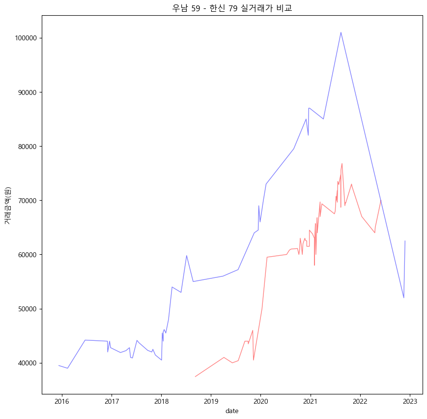

```python
----
layout:single
title:"부동산_필터링된파일만"
---
```


```python
import pandas as pd
import matplotlib.pyplot as plt
```

## 필터링 데이터 불러오기


```python
h = pd.read_excel("C:\\Users\\kimjaehee\\MyPythonTest\\(연습)개인\\data_file/all_filter.xlsx")  
```


```python
h
```


<div>
<style scoped>
    .dataframe tbody tr th:only-of-type {
        vertical-align: middle;
    }

    .dataframe tbody tr th {
        vertical-align: top;
    }

    .dataframe thead th {
        text-align: right;
    }
</style>
<table border="1" class="dataframe">
  <thead>
    <tr style="text-align: right;">
      <th></th>
      <th>시군구</th>
      <th>단지명</th>
      <th>전용면적(㎡)</th>
      <th>계약년월</th>
      <th>계약일</th>
      <th>거래금액(만원)</th>
      <th>층</th>
      <th>date</th>
    </tr>
  </thead>
  <tbody>
    <tr>
      <th>0</th>
      <td>경기도 화성시 기산동</td>
      <td>삼성래미안1차</td>
      <td>113.245</td>
      <td>201512</td>
      <td>9</td>
      <td>28700</td>
      <td>2</td>
      <td>2015-12-09</td>
    </tr>
    <tr>
      <th>1</th>
      <td>경기도 화성시 기산동</td>
      <td>삼성래미안1차</td>
      <td>84.987</td>
      <td>201512</td>
      <td>19</td>
      <td>23300</td>
      <td>9</td>
      <td>2015-12-19</td>
    </tr>
    <tr>
      <th>2</th>
      <td>경기도 화성시 기산동</td>
      <td>삼성래미안1차</td>
      <td>84.987</td>
      <td>201601</td>
      <td>14</td>
      <td>21800</td>
      <td>2</td>
      <td>2016-01-14</td>
    </tr>
    <tr>
      <th>3</th>
      <td>경기도 화성시 기산동</td>
      <td>삼성래미안1차</td>
      <td>84.987</td>
      <td>201601</td>
      <td>16</td>
      <td>22400</td>
      <td>11</td>
      <td>2016-01-16</td>
    </tr>
    <tr>
      <th>4</th>
      <td>경기도 화성시 기산동</td>
      <td>삼성래미안1차</td>
      <td>84.987</td>
      <td>201601</td>
      <td>16</td>
      <td>22800</td>
      <td>11</td>
      <td>2016-01-16</td>
    </tr>
    <tr>
      <th>...</th>
      <td>...</td>
      <td>...</td>
      <td>...</td>
      <td>...</td>
      <td>...</td>
      <td>...</td>
      <td>...</td>
      <td>...</td>
    </tr>
    <tr>
      <th>70236</th>
      <td>경기도 화성시 향남읍 행정리</td>
      <td>화성향남시범복사꽃마을한국아델리</td>
      <td>84.956</td>
      <td>202203</td>
      <td>7</td>
      <td>42500</td>
      <td>7</td>
      <td>2022-03-07</td>
    </tr>
    <tr>
      <th>70237</th>
      <td>경기도 화성시 향남읍 행정리</td>
      <td>화성향남시범복사꽃마을한국아델리</td>
      <td>84.956</td>
      <td>202204</td>
      <td>9</td>
      <td>42000</td>
      <td>5</td>
      <td>2022-04-09</td>
    </tr>
    <tr>
      <th>70238</th>
      <td>경기도 화성시 향남읍 행정리</td>
      <td>화성향남시범복사꽃마을한국아델리</td>
      <td>84.956</td>
      <td>202205</td>
      <td>3</td>
      <td>44000</td>
      <td>13</td>
      <td>2022-05-03</td>
    </tr>
    <tr>
      <th>70239</th>
      <td>경기도 화성시 향남읍 행정리</td>
      <td>화성향남시범복사꽃마을한국아델리</td>
      <td>84.956</td>
      <td>202205</td>
      <td>20</td>
      <td>41100</td>
      <td>3</td>
      <td>2022-05-20</td>
    </tr>
    <tr>
      <th>70240</th>
      <td>경기도 화성시 향남읍 행정리</td>
      <td>화성향남시범복사꽃마을한국아델리</td>
      <td>84.971</td>
      <td>202205</td>
      <td>21</td>
      <td>40000</td>
      <td>5</td>
      <td>2022-05-21</td>
    </tr>
  </tbody>
</table>
<p>70241 rows × 8 columns</p>
</div>


### 키워드로 검색


```python
a = h[h["단지명"].str.contains("부영")]
a["단지명"].unique()
a["단지명"].value_counts()
```


    동탄에듀밸리사랑으로부영아파트      558
    청계숲사랑으로부영아파트         262
    더레이크시티부영6단지          133
    더레이크시티부영1단지           96
    더레이크시티부영5단지           82
    더레이크시티부영4단지           56
    더레이크시티부영3단지           49
    더레이크시티부영2단지           38
    화성향남서봉마을사랑으로부영3단지     19
    Name: 단지명, dtype: int64


#내가 원하는 단지만


```python
hanshin = h[h["단지명"] == "한신더휴"]
```


```python
hanshin
```


<div>
<style scoped>
    .dataframe tbody tr th:only-of-type {
        vertical-align: middle;
    }

    .dataframe tbody tr th {
        vertical-align: top;
    }

    .dataframe thead th {
        text-align: right;
    }
</style>
<table border="1" class="dataframe">
  <thead>
    <tr style="text-align: right;">
      <th></th>
      <th>시군구</th>
      <th>단지명</th>
      <th>전용면적(㎡)</th>
      <th>계약년월</th>
      <th>계약일</th>
      <th>거래금액(만원)</th>
      <th>층</th>
      <th>date</th>
    </tr>
  </thead>
  <tbody>
    <tr>
      <th>19370</th>
      <td>경기도 화성시 목동</td>
      <td>한신더휴</td>
      <td>76.4713</td>
      <td>201809</td>
      <td>8</td>
      <td>37465</td>
      <td>3</td>
      <td>2018-09-08</td>
    </tr>
    <tr>
      <th>19371</th>
      <td>경기도 화성시 목동</td>
      <td>한신더휴</td>
      <td>83.7489</td>
      <td>201811</td>
      <td>1</td>
      <td>40145</td>
      <td>25</td>
      <td>2018-11-01</td>
    </tr>
    <tr>
      <th>28335</th>
      <td>경기도 화성시 목동</td>
      <td>한신더휴</td>
      <td>83.4162</td>
      <td>201903</td>
      <td>1</td>
      <td>42000</td>
      <td>7</td>
      <td>2019-03-01</td>
    </tr>
    <tr>
      <th>28336</th>
      <td>경기도 화성시 목동</td>
      <td>한신더휴</td>
      <td>76.4713</td>
      <td>201904</td>
      <td>6</td>
      <td>41000</td>
      <td>10</td>
      <td>2019-04-06</td>
    </tr>
    <tr>
      <th>28337</th>
      <td>경기도 화성시 목동</td>
      <td>한신더휴</td>
      <td>83.4162</td>
      <td>201905</td>
      <td>23</td>
      <td>45500</td>
      <td>13</td>
      <td>2019-05-23</td>
    </tr>
    <tr>
      <th>...</th>
      <td>...</td>
      <td>...</td>
      <td>...</td>
      <td>...</td>
      <td>...</td>
      <td>...</td>
      <td>...</td>
      <td>...</td>
    </tr>
    <tr>
      <th>67680</th>
      <td>경기도 화성시 목동</td>
      <td>한신더휴</td>
      <td>83.7489</td>
      <td>202208</td>
      <td>18</td>
      <td>67000</td>
      <td>5</td>
      <td>2022-08-18</td>
    </tr>
    <tr>
      <th>67681</th>
      <td>경기도 화성시 목동</td>
      <td>한신더휴</td>
      <td>83.4162</td>
      <td>202208</td>
      <td>19</td>
      <td>61000</td>
      <td>12</td>
      <td>2022-08-19</td>
    </tr>
    <tr>
      <th>67682</th>
      <td>경기도 화성시 목동</td>
      <td>한신더휴</td>
      <td>83.4162</td>
      <td>202209</td>
      <td>23</td>
      <td>60000</td>
      <td>17</td>
      <td>2022-09-23</td>
    </tr>
    <tr>
      <th>67683</th>
      <td>경기도 화성시 목동</td>
      <td>한신더휴</td>
      <td>83.7489</td>
      <td>202210</td>
      <td>1</td>
      <td>61200</td>
      <td>22</td>
      <td>2022-10-01</td>
    </tr>
    <tr>
      <th>67684</th>
      <td>경기도 화성시 목동</td>
      <td>한신더휴</td>
      <td>83.4162</td>
      <td>202211</td>
      <td>11</td>
      <td>45000</td>
      <td>14</td>
      <td>2022-11-11</td>
    </tr>
  </tbody>
</table>
<p>135 rows × 8 columns</p>
</div>


```python

```


```python
#내가 원하는 조건만
con0 = h["단지명"] == "한신더휴"
con1 = h["전용면적(㎡)"] == 76.4713
hanshin_condition = h[(con1 & con1)]
```


```python
hanshin_condition
```


<div>
<style scoped>
    .dataframe tbody tr th:only-of-type {
        vertical-align: middle;
    }

    .dataframe tbody tr th {
        vertical-align: top;
    }

    .dataframe thead th {
        text-align: right;
    }
</style>
<table border="1" class="dataframe">
  <thead>
    <tr style="text-align: right;">
      <th></th>
      <th>시군구</th>
      <th>단지명</th>
      <th>전용면적(㎡)</th>
      <th>계약년월</th>
      <th>계약일</th>
      <th>거래금액(만원)</th>
      <th>층</th>
      <th>date</th>
    </tr>
  </thead>
  <tbody>
    <tr>
      <th>19370</th>
      <td>경기도 화성시 목동</td>
      <td>한신더휴</td>
      <td>76.4713</td>
      <td>201809</td>
      <td>8</td>
      <td>37465</td>
      <td>3</td>
      <td>2018-09-08</td>
    </tr>
    <tr>
      <th>28336</th>
      <td>경기도 화성시 목동</td>
      <td>한신더휴</td>
      <td>76.4713</td>
      <td>201904</td>
      <td>6</td>
      <td>41000</td>
      <td>10</td>
      <td>2019-04-06</td>
    </tr>
    <tr>
      <th>28338</th>
      <td>경기도 화성시 목동</td>
      <td>한신더휴</td>
      <td>76.4713</td>
      <td>201906</td>
      <td>7</td>
      <td>40000</td>
      <td>13</td>
      <td>2019-06-07</td>
    </tr>
    <tr>
      <th>28344</th>
      <td>경기도 화성시 목동</td>
      <td>한신더휴</td>
      <td>76.4713</td>
      <td>201907</td>
      <td>20</td>
      <td>40400</td>
      <td>15</td>
      <td>2019-07-20</td>
    </tr>
    <tr>
      <th>28346</th>
      <td>경기도 화성시 목동</td>
      <td>한신더휴</td>
      <td>76.4713</td>
      <td>201909</td>
      <td>7</td>
      <td>44000</td>
      <td>21</td>
      <td>2019-09-07</td>
    </tr>
    <tr>
      <th>...</th>
      <td>...</td>
      <td>...</td>
      <td>...</td>
      <td>...</td>
      <td>...</td>
      <td>...</td>
      <td>...</td>
      <td>...</td>
    </tr>
    <tr>
      <th>56917</th>
      <td>경기도 화성시 목동</td>
      <td>한신더휴</td>
      <td>76.4713</td>
      <td>202111</td>
      <td>3</td>
      <td>72500</td>
      <td>21</td>
      <td>2021-11-03</td>
    </tr>
    <tr>
      <th>67671</th>
      <td>경기도 화성시 목동</td>
      <td>한신더휴</td>
      <td>76.4713</td>
      <td>202201</td>
      <td>13</td>
      <td>67000</td>
      <td>19</td>
      <td>2022-01-13</td>
    </tr>
    <tr>
      <th>67673</th>
      <td>경기도 화성시 목동</td>
      <td>한신더휴</td>
      <td>76.4713</td>
      <td>202204</td>
      <td>19</td>
      <td>64000</td>
      <td>9</td>
      <td>2022-04-19</td>
    </tr>
    <tr>
      <th>67674</th>
      <td>경기도 화성시 목동</td>
      <td>한신더휴</td>
      <td>76.4713</td>
      <td>202204</td>
      <td>22</td>
      <td>65000</td>
      <td>16</td>
      <td>2022-04-22</td>
    </tr>
    <tr>
      <th>67678</th>
      <td>경기도 화성시 목동</td>
      <td>한신더휴</td>
      <td>76.4713</td>
      <td>202206</td>
      <td>3</td>
      <td>70000</td>
      <td>5</td>
      <td>2022-06-03</td>
    </tr>
  </tbody>
</table>
<p>62 rows × 8 columns</p>
</div>


```python
hanshin
```


<div>
<style scoped>
    .dataframe tbody tr th:only-of-type {
        vertical-align: middle;
    }

    .dataframe tbody tr th {
        vertical-align: top;
    }

    .dataframe thead th {
        text-align: right;
    }
</style>
<table border="1" class="dataframe">
  <thead>
    <tr style="text-align: right;">
      <th></th>
      <th>시군구</th>
      <th>단지명</th>
      <th>전용면적(㎡)</th>
      <th>계약년월</th>
      <th>계약일</th>
      <th>거래금액(만원)</th>
      <th>층</th>
      <th>date</th>
    </tr>
  </thead>
  <tbody>
    <tr>
      <th>19370</th>
      <td>경기도 화성시 목동</td>
      <td>한신더휴</td>
      <td>76.4713</td>
      <td>201809</td>
      <td>8</td>
      <td>37465</td>
      <td>3</td>
      <td>2018-09-08</td>
    </tr>
    <tr>
      <th>19371</th>
      <td>경기도 화성시 목동</td>
      <td>한신더휴</td>
      <td>83.7489</td>
      <td>201811</td>
      <td>1</td>
      <td>40145</td>
      <td>25</td>
      <td>2018-11-01</td>
    </tr>
    <tr>
      <th>28335</th>
      <td>경기도 화성시 목동</td>
      <td>한신더휴</td>
      <td>83.4162</td>
      <td>201903</td>
      <td>1</td>
      <td>42000</td>
      <td>7</td>
      <td>2019-03-01</td>
    </tr>
    <tr>
      <th>28336</th>
      <td>경기도 화성시 목동</td>
      <td>한신더휴</td>
      <td>76.4713</td>
      <td>201904</td>
      <td>6</td>
      <td>41000</td>
      <td>10</td>
      <td>2019-04-06</td>
    </tr>
    <tr>
      <th>28337</th>
      <td>경기도 화성시 목동</td>
      <td>한신더휴</td>
      <td>83.4162</td>
      <td>201905</td>
      <td>23</td>
      <td>45500</td>
      <td>13</td>
      <td>2019-05-23</td>
    </tr>
    <tr>
      <th>...</th>
      <td>...</td>
      <td>...</td>
      <td>...</td>
      <td>...</td>
      <td>...</td>
      <td>...</td>
      <td>...</td>
      <td>...</td>
    </tr>
    <tr>
      <th>67680</th>
      <td>경기도 화성시 목동</td>
      <td>한신더휴</td>
      <td>83.7489</td>
      <td>202208</td>
      <td>18</td>
      <td>67000</td>
      <td>5</td>
      <td>2022-08-18</td>
    </tr>
    <tr>
      <th>67681</th>
      <td>경기도 화성시 목동</td>
      <td>한신더휴</td>
      <td>83.4162</td>
      <td>202208</td>
      <td>19</td>
      <td>61000</td>
      <td>12</td>
      <td>2022-08-19</td>
    </tr>
    <tr>
      <th>67682</th>
      <td>경기도 화성시 목동</td>
      <td>한신더휴</td>
      <td>83.4162</td>
      <td>202209</td>
      <td>23</td>
      <td>60000</td>
      <td>17</td>
      <td>2022-09-23</td>
    </tr>
    <tr>
      <th>67683</th>
      <td>경기도 화성시 목동</td>
      <td>한신더휴</td>
      <td>83.7489</td>
      <td>202210</td>
      <td>1</td>
      <td>61200</td>
      <td>22</td>
      <td>2022-10-01</td>
    </tr>
    <tr>
      <th>67684</th>
      <td>경기도 화성시 목동</td>
      <td>한신더휴</td>
      <td>83.4162</td>
      <td>202211</td>
      <td>11</td>
      <td>45000</td>
      <td>14</td>
      <td>2022-11-11</td>
    </tr>
  </tbody>
</table>
<p>135 rows × 8 columns</p>
</div>


```python
## 면적이 뭐가 있는지..
hanshin["전용면적(㎡)"].value_counts()
```


    76.4713    62
    83.7489    46
    83.4162    27
    Name: 전용면적(㎡), dtype: int64


```python
## 최근 거래 10건 - 전체
#hanshin.sort_values(by=["date"], ascending=False).head(10)

# 최근 거래 10건 - 76제곱
hanshin[hanshin["전용면적(㎡)"] == 76.4713].sort_values(by=["date"], ascending=False).head(10)
# 최근 거래 10건 - 84제곱

## 조건이 2개일때 괄호를 넣어야 한다..
#hanshin[(hanshin["전용면적(㎡)"] == 83.7489) | (hanshin["전용면적(㎡)"] == 83.4162)].sort_values(by=["date"], ascending=False).head(10)


```


<div>
<style scoped>
    .dataframe tbody tr th:only-of-type {
        vertical-align: middle;
    }

    .dataframe tbody tr th {
        vertical-align: top;
    }

    .dataframe thead th {
        text-align: right;
    }
</style>
<table border="1" class="dataframe">
  <thead>
    <tr style="text-align: right;">
      <th></th>
      <th>시군구</th>
      <th>단지명</th>
      <th>전용면적(㎡)</th>
      <th>계약년월</th>
      <th>계약일</th>
      <th>거래금액(만원)</th>
      <th>층</th>
      <th>date</th>
    </tr>
  </thead>
  <tbody>
    <tr>
      <th>67678</th>
      <td>경기도 화성시 목동</td>
      <td>한신더휴</td>
      <td>76.4713</td>
      <td>202206</td>
      <td>3</td>
      <td>70000</td>
      <td>5</td>
      <td>2022-06-03</td>
    </tr>
    <tr>
      <th>67674</th>
      <td>경기도 화성시 목동</td>
      <td>한신더휴</td>
      <td>76.4713</td>
      <td>202204</td>
      <td>22</td>
      <td>65000</td>
      <td>16</td>
      <td>2022-04-22</td>
    </tr>
    <tr>
      <th>67673</th>
      <td>경기도 화성시 목동</td>
      <td>한신더휴</td>
      <td>76.4713</td>
      <td>202204</td>
      <td>19</td>
      <td>64000</td>
      <td>9</td>
      <td>2022-04-19</td>
    </tr>
    <tr>
      <th>67671</th>
      <td>경기도 화성시 목동</td>
      <td>한신더휴</td>
      <td>76.4713</td>
      <td>202201</td>
      <td>13</td>
      <td>67000</td>
      <td>19</td>
      <td>2022-01-13</td>
    </tr>
    <tr>
      <th>56917</th>
      <td>경기도 화성시 목동</td>
      <td>한신더휴</td>
      <td>76.4713</td>
      <td>202111</td>
      <td>3</td>
      <td>72500</td>
      <td>21</td>
      <td>2021-11-03</td>
    </tr>
    <tr>
      <th>56916</th>
      <td>경기도 화성시 목동</td>
      <td>한신더휴</td>
      <td>76.4713</td>
      <td>202110</td>
      <td>30</td>
      <td>73000</td>
      <td>21</td>
      <td>2021-10-30</td>
    </tr>
    <tr>
      <th>56913</th>
      <td>경기도 화성시 목동</td>
      <td>한신더휴</td>
      <td>76.4713</td>
      <td>202109</td>
      <td>17</td>
      <td>69500</td>
      <td>1</td>
      <td>2021-09-17</td>
    </tr>
    <tr>
      <th>56912</th>
      <td>경기도 화성시 목동</td>
      <td>한신더휴</td>
      <td>76.4713</td>
      <td>202109</td>
      <td>15</td>
      <td>69600</td>
      <td>2</td>
      <td>2021-09-15</td>
    </tr>
    <tr>
      <th>56911</th>
      <td>경기도 화성시 목동</td>
      <td>한신더휴</td>
      <td>76.4713</td>
      <td>202109</td>
      <td>11</td>
      <td>69000</td>
      <td>1</td>
      <td>2021-09-11</td>
    </tr>
    <tr>
      <th>56910</th>
      <td>경기도 화성시 목동</td>
      <td>한신더휴</td>
      <td>76.4713</td>
      <td>202108</td>
      <td>21</td>
      <td>76800</td>
      <td>21</td>
      <td>2021-08-21</td>
    </tr>
  </tbody>
</table>
</div>


```python
wonam = h[h["단지명"] == "동탄역 시범우남퍼스트빌아파트"]
```


```python
# 면적 검사
wonam["전용면적(㎡)"].value_counts()
```


    73.96    128
    84.98    119
    59.98    101
    84.94     98
    59.95     67
    69.98     55
    59.99     47
    Name: 전용면적(㎡), dtype: int64


```python
#내가 원하는 조건만
con0_w = h["단지명"] == "동탄역 시범우남퍼스트빌아파트"
con1_w = h["전용면적(㎡)"] == 59.99
wonam_condition = wonam[(con0_w & con1_w)]
```

    C:\Users\kimjaehee\AppData\Local\Temp\ipykernel_5244\3666230628.py:4: UserWarning: Boolean Series key will be reindexed to match DataFrame index.
      wonam_condition = wonam[(con0_w & con1_w)]
    


```python
wonam_condition
```


<div>
<style scoped>
    .dataframe tbody tr th:only-of-type {
        vertical-align: middle;
    }

    .dataframe tbody tr th {
        vertical-align: top;
    }

    .dataframe thead th {
        text-align: right;
    }
</style>
<table border="1" class="dataframe">
  <thead>
    <tr style="text-align: right;">
      <th></th>
      <th>시군구</th>
      <th>단지명</th>
      <th>전용면적(㎡)</th>
      <th>계약년월</th>
      <th>계약일</th>
      <th>거래금액(만원)</th>
      <th>층</th>
      <th>date</th>
    </tr>
  </thead>
  <tbody>
    <tr>
      <th>9391</th>
      <td>경기도 화성시 청계동</td>
      <td>동탄역 시범우남퍼스트빌아파트</td>
      <td>59.99</td>
      <td>201512</td>
      <td>10</td>
      <td>39500</td>
      <td>4</td>
      <td>2015-12-10</td>
    </tr>
    <tr>
      <th>9394</th>
      <td>경기도 화성시 청계동</td>
      <td>동탄역 시범우남퍼스트빌아파트</td>
      <td>59.99</td>
      <td>201602</td>
      <td>12</td>
      <td>39000</td>
      <td>22</td>
      <td>2016-02-12</td>
    </tr>
    <tr>
      <th>9406</th>
      <td>경기도 화성시 청계동</td>
      <td>동탄역 시범우남퍼스트빌아파트</td>
      <td>59.99</td>
      <td>201606</td>
      <td>20</td>
      <td>44200</td>
      <td>19</td>
      <td>2016-06-20</td>
    </tr>
    <tr>
      <th>9419</th>
      <td>경기도 화성시 청계동</td>
      <td>동탄역 시범우남퍼스트빌아파트</td>
      <td>59.99</td>
      <td>201612</td>
      <td>1</td>
      <td>44000</td>
      <td>10</td>
      <td>2016-12-01</td>
    </tr>
    <tr>
      <th>16433</th>
      <td>경기도 화성시 청계동</td>
      <td>동탄역 시범우남퍼스트빌아파트</td>
      <td>59.99</td>
      <td>201612</td>
      <td>3</td>
      <td>42000</td>
      <td>11</td>
      <td>2016-12-03</td>
    </tr>
    <tr>
      <th>16437</th>
      <td>경기도 화성시 청계동</td>
      <td>동탄역 시범우남퍼스트빌아파트</td>
      <td>59.99</td>
      <td>201612</td>
      <td>17</td>
      <td>44000</td>
      <td>16</td>
      <td>2016-12-17</td>
    </tr>
    <tr>
      <th>16438</th>
      <td>경기도 화성시 청계동</td>
      <td>동탄역 시범우남퍼스트빌아파트</td>
      <td>59.99</td>
      <td>201612</td>
      <td>24</td>
      <td>42800</td>
      <td>17</td>
      <td>2016-12-24</td>
    </tr>
    <tr>
      <th>16445</th>
      <td>경기도 화성시 청계동</td>
      <td>동탄역 시범우남퍼스트빌아파트</td>
      <td>59.99</td>
      <td>201703</td>
      <td>7</td>
      <td>41900</td>
      <td>7</td>
      <td>2017-03-07</td>
    </tr>
    <tr>
      <th>16459</th>
      <td>경기도 화성시 청계동</td>
      <td>동탄역 시범우남퍼스트빌아파트</td>
      <td>59.99</td>
      <td>201704</td>
      <td>16</td>
      <td>42250</td>
      <td>26</td>
      <td>2017-04-16</td>
    </tr>
    <tr>
      <th>16463</th>
      <td>경기도 화성시 청계동</td>
      <td>동탄역 시범우남퍼스트빌아파트</td>
      <td>59.99</td>
      <td>201705</td>
      <td>12</td>
      <td>42800</td>
      <td>11</td>
      <td>2017-05-12</td>
    </tr>
    <tr>
      <th>16464</th>
      <td>경기도 화성시 청계동</td>
      <td>동탄역 시범우남퍼스트빌아파트</td>
      <td>59.99</td>
      <td>201705</td>
      <td>13</td>
      <td>42500</td>
      <td>13</td>
      <td>2017-05-13</td>
    </tr>
    <tr>
      <th>16469</th>
      <td>경기도 화성시 청계동</td>
      <td>동탄역 시범우남퍼스트빌아파트</td>
      <td>59.99</td>
      <td>201705</td>
      <td>20</td>
      <td>41000</td>
      <td>2</td>
      <td>2017-05-20</td>
    </tr>
    <tr>
      <th>16480</th>
      <td>경기도 화성시 청계동</td>
      <td>동탄역 시범우남퍼스트빌아파트</td>
      <td>59.99</td>
      <td>201706</td>
      <td>3</td>
      <td>40900</td>
      <td>3</td>
      <td>2017-06-03</td>
    </tr>
    <tr>
      <th>16494</th>
      <td>경기도 화성시 청계동</td>
      <td>동탄역 시범우남퍼스트빌아파트</td>
      <td>59.99</td>
      <td>201707</td>
      <td>6</td>
      <td>44150</td>
      <td>18</td>
      <td>2017-07-06</td>
    </tr>
    <tr>
      <th>16498</th>
      <td>경기도 화성시 청계동</td>
      <td>동탄역 시범우남퍼스트빌아파트</td>
      <td>59.99</td>
      <td>201707</td>
      <td>21</td>
      <td>43700</td>
      <td>9</td>
      <td>2017-07-21</td>
    </tr>
    <tr>
      <th>16512</th>
      <td>경기도 화성시 청계동</td>
      <td>동탄역 시범우남퍼스트빌아파트</td>
      <td>59.99</td>
      <td>201709</td>
      <td>23</td>
      <td>42300</td>
      <td>14</td>
      <td>2017-09-23</td>
    </tr>
    <tr>
      <th>16522</th>
      <td>경기도 화성시 청계동</td>
      <td>동탄역 시범우남퍼스트빌아파트</td>
      <td>59.99</td>
      <td>201710</td>
      <td>23</td>
      <td>42000</td>
      <td>19</td>
      <td>2017-10-23</td>
    </tr>
    <tr>
      <th>16523</th>
      <td>경기도 화성시 청계동</td>
      <td>동탄역 시범우남퍼스트빌아파트</td>
      <td>59.99</td>
      <td>201710</td>
      <td>31</td>
      <td>42500</td>
      <td>23</td>
      <td>2017-10-31</td>
    </tr>
    <tr>
      <th>16530</th>
      <td>경기도 화성시 청계동</td>
      <td>동탄역 시범우남퍼스트빌아파트</td>
      <td>59.99</td>
      <td>201711</td>
      <td>18</td>
      <td>41450</td>
      <td>2</td>
      <td>2017-11-18</td>
    </tr>
    <tr>
      <th>24884</th>
      <td>경기도 화성시 청계동</td>
      <td>동탄역 시범우남퍼스트빌아파트</td>
      <td>59.99</td>
      <td>201801</td>
      <td>3</td>
      <td>40500</td>
      <td>5</td>
      <td>2018-01-03</td>
    </tr>
    <tr>
      <th>24893</th>
      <td>경기도 화성시 청계동</td>
      <td>동탄역 시범우남퍼스트빌아파트</td>
      <td>59.99</td>
      <td>201801</td>
      <td>8</td>
      <td>45500</td>
      <td>20</td>
      <td>2018-01-08</td>
    </tr>
    <tr>
      <th>24900</th>
      <td>경기도 화성시 청계동</td>
      <td>동탄역 시범우남퍼스트빌아파트</td>
      <td>59.99</td>
      <td>201801</td>
      <td>15</td>
      <td>44000</td>
      <td>15</td>
      <td>2018-01-15</td>
    </tr>
    <tr>
      <th>24901</th>
      <td>경기도 화성시 청계동</td>
      <td>동탄역 시범우남퍼스트빌아파트</td>
      <td>59.99</td>
      <td>201801</td>
      <td>15</td>
      <td>45700</td>
      <td>8</td>
      <td>2018-01-15</td>
    </tr>
    <tr>
      <th>24919</th>
      <td>경기도 화성시 청계동</td>
      <td>동탄역 시범우남퍼스트빌아파트</td>
      <td>59.99</td>
      <td>201801</td>
      <td>22</td>
      <td>46150</td>
      <td>17</td>
      <td>2018-01-22</td>
    </tr>
    <tr>
      <th>24931</th>
      <td>경기도 화성시 청계동</td>
      <td>동탄역 시범우남퍼스트빌아파트</td>
      <td>59.99</td>
      <td>201802</td>
      <td>3</td>
      <td>45500</td>
      <td>4</td>
      <td>2018-02-03</td>
    </tr>
    <tr>
      <th>24950</th>
      <td>경기도 화성시 청계동</td>
      <td>동탄역 시범우남퍼스트빌아파트</td>
      <td>59.99</td>
      <td>201802</td>
      <td>23</td>
      <td>48000</td>
      <td>19</td>
      <td>2018-02-23</td>
    </tr>
    <tr>
      <th>24963</th>
      <td>경기도 화성시 청계동</td>
      <td>동탄역 시범우남퍼스트빌아파트</td>
      <td>59.99</td>
      <td>201803</td>
      <td>21</td>
      <td>54000</td>
      <td>6</td>
      <td>2018-03-21</td>
    </tr>
    <tr>
      <th>24975</th>
      <td>경기도 화성시 청계동</td>
      <td>동탄역 시범우남퍼스트빌아파트</td>
      <td>59.99</td>
      <td>201805</td>
      <td>26</td>
      <td>53000</td>
      <td>12</td>
      <td>2018-05-26</td>
    </tr>
    <tr>
      <th>24988</th>
      <td>경기도 화성시 청계동</td>
      <td>동탄역 시범우남퍼스트빌아파트</td>
      <td>59.99</td>
      <td>201807</td>
      <td>6</td>
      <td>59800</td>
      <td>22</td>
      <td>2018-07-06</td>
    </tr>
    <tr>
      <th>25001</th>
      <td>경기도 화성시 청계동</td>
      <td>동탄역 시범우남퍼스트빌아파트</td>
      <td>59.99</td>
      <td>201808</td>
      <td>23</td>
      <td>55000</td>
      <td>2</td>
      <td>2018-08-23</td>
    </tr>
    <tr>
      <th>33997</th>
      <td>경기도 화성시 청계동</td>
      <td>동탄역 시범우남퍼스트빌아파트</td>
      <td>59.99</td>
      <td>201903</td>
      <td>30</td>
      <td>56000</td>
      <td>9</td>
      <td>2019-03-30</td>
    </tr>
    <tr>
      <th>34021</th>
      <td>경기도 화성시 청계동</td>
      <td>동탄역 시범우남퍼스트빌아파트</td>
      <td>59.99</td>
      <td>201907</td>
      <td>19</td>
      <td>57200</td>
      <td>23</td>
      <td>2019-07-19</td>
    </tr>
    <tr>
      <th>34080</th>
      <td>경기도 화성시 청계동</td>
      <td>동탄역 시범우남퍼스트빌아파트</td>
      <td>59.99</td>
      <td>201911</td>
      <td>15</td>
      <td>64000</td>
      <td>10</td>
      <td>2019-11-15</td>
    </tr>
    <tr>
      <th>51529</th>
      <td>경기도 화성시 청계동</td>
      <td>동탄역 시범우남퍼스트빌아파트</td>
      <td>59.99</td>
      <td>201912</td>
      <td>14</td>
      <td>64500</td>
      <td>11</td>
      <td>2019-12-14</td>
    </tr>
    <tr>
      <th>51533</th>
      <td>경기도 화성시 청계동</td>
      <td>동탄역 시범우남퍼스트빌아파트</td>
      <td>59.99</td>
      <td>201912</td>
      <td>18</td>
      <td>69000</td>
      <td>24</td>
      <td>2019-12-18</td>
    </tr>
    <tr>
      <th>51546</th>
      <td>경기도 화성시 청계동</td>
      <td>동탄역 시범우남퍼스트빌아파트</td>
      <td>59.99</td>
      <td>201912</td>
      <td>28</td>
      <td>66000</td>
      <td>26</td>
      <td>2019-12-28</td>
    </tr>
    <tr>
      <th>51554</th>
      <td>경기도 화성시 청계동</td>
      <td>동탄역 시범우남퍼스트빌아파트</td>
      <td>59.99</td>
      <td>202001</td>
      <td>21</td>
      <td>70000</td>
      <td>7</td>
      <td>2020-01-21</td>
    </tr>
    <tr>
      <th>51557</th>
      <td>경기도 화성시 청계동</td>
      <td>동탄역 시범우남퍼스트빌아파트</td>
      <td>59.99</td>
      <td>202002</td>
      <td>10</td>
      <td>73000</td>
      <td>18</td>
      <td>2020-02-10</td>
    </tr>
    <tr>
      <th>51607</th>
      <td>경기도 화성시 청계동</td>
      <td>동탄역 시범우남퍼스트빌아파트</td>
      <td>59.99</td>
      <td>202008</td>
      <td>31</td>
      <td>79500</td>
      <td>12</td>
      <td>2020-08-31</td>
    </tr>
    <tr>
      <th>51642</th>
      <td>경기도 화성시 청계동</td>
      <td>동탄역 시범우남퍼스트빌아파트</td>
      <td>59.99</td>
      <td>202011</td>
      <td>30</td>
      <td>85000</td>
      <td>9</td>
      <td>2020-11-30</td>
    </tr>
    <tr>
      <th>65532</th>
      <td>경기도 화성시 청계동</td>
      <td>동탄역 시범우남퍼스트빌아파트</td>
      <td>59.99</td>
      <td>202012</td>
      <td>16</td>
      <td>82000</td>
      <td>4</td>
      <td>2020-12-16</td>
    </tr>
    <tr>
      <th>65536</th>
      <td>경기도 화성시 청계동</td>
      <td>동탄역 시범우남퍼스트빌아파트</td>
      <td>59.99</td>
      <td>202012</td>
      <td>19</td>
      <td>87000</td>
      <td>20</td>
      <td>2020-12-19</td>
    </tr>
    <tr>
      <th>65537</th>
      <td>경기도 화성시 청계동</td>
      <td>동탄역 시범우남퍼스트빌아파트</td>
      <td>59.99</td>
      <td>202012</td>
      <td>26</td>
      <td>87000</td>
      <td>21</td>
      <td>2020-12-26</td>
    </tr>
    <tr>
      <th>65547</th>
      <td>경기도 화성시 청계동</td>
      <td>동탄역 시범우남퍼스트빌아파트</td>
      <td>59.99</td>
      <td>202104</td>
      <td>6</td>
      <td>85000</td>
      <td>9</td>
      <td>2021-04-06</td>
    </tr>
    <tr>
      <th>65572</th>
      <td>경기도 화성시 청계동</td>
      <td>동탄역 시범우남퍼스트빌아파트</td>
      <td>59.99</td>
      <td>202108</td>
      <td>13</td>
      <td>101000</td>
      <td>4</td>
      <td>2021-08-13</td>
    </tr>
    <tr>
      <th>69596</th>
      <td>경기도 화성시 청계동</td>
      <td>동탄역 시범우남퍼스트빌아파트</td>
      <td>59.99</td>
      <td>202211</td>
      <td>18</td>
      <td>52000</td>
      <td>7</td>
      <td>2022-11-18</td>
    </tr>
    <tr>
      <th>69598</th>
      <td>경기도 화성시 청계동</td>
      <td>동탄역 시범우남퍼스트빌아파트</td>
      <td>59.99</td>
      <td>202211</td>
      <td>27</td>
      <td>62500</td>
      <td>2</td>
      <td>2022-11-27</td>
    </tr>
  </tbody>
</table>
</div>


```python
hils = h[h["단지명"] == "힐스테이트동탄"]
```


```python
hils
```


<div>
<style scoped>
    .dataframe tbody tr th:only-of-type {
        vertical-align: middle;
    }

    .dataframe tbody tr th {
        vertical-align: top;
    }

    .dataframe thead th {
        text-align: right;
    }
</style>
<table border="1" class="dataframe">
  <thead>
    <tr style="text-align: right;">
      <th></th>
      <th>시군구</th>
      <th>단지명</th>
      <th>전용면적(㎡)</th>
      <th>계약년월</th>
      <th>계약일</th>
      <th>거래금액(만원)</th>
      <th>층</th>
      <th>date</th>
    </tr>
  </thead>
  <tbody>
    <tr>
      <th>28412</th>
      <td>경기도 화성시 목동</td>
      <td>힐스테이트동탄</td>
      <td>61.9248</td>
      <td>201904</td>
      <td>20</td>
      <td>34988</td>
      <td>4</td>
      <td>2019-04-20</td>
    </tr>
    <tr>
      <th>28413</th>
      <td>경기도 화성시 목동</td>
      <td>힐스테이트동탄</td>
      <td>84.8479</td>
      <td>201904</td>
      <td>21</td>
      <td>48213</td>
      <td>11</td>
      <td>2019-04-21</td>
    </tr>
    <tr>
      <th>28414</th>
      <td>경기도 화성시 목동</td>
      <td>힐스테이트동탄</td>
      <td>74.9502</td>
      <td>201908</td>
      <td>23</td>
      <td>41000</td>
      <td>24</td>
      <td>2019-08-23</td>
    </tr>
    <tr>
      <th>28415</th>
      <td>경기도 화성시 목동</td>
      <td>힐스테이트동탄</td>
      <td>84.8835</td>
      <td>201908</td>
      <td>27</td>
      <td>40332</td>
      <td>23</td>
      <td>2019-08-27</td>
    </tr>
    <tr>
      <th>28416</th>
      <td>경기도 화성시 목동</td>
      <td>힐스테이트동탄</td>
      <td>84.8479</td>
      <td>201908</td>
      <td>30</td>
      <td>46500</td>
      <td>2</td>
      <td>2019-08-30</td>
    </tr>
    <tr>
      <th>...</th>
      <td>...</td>
      <td>...</td>
      <td>...</td>
      <td>...</td>
      <td>...</td>
      <td>...</td>
      <td>...</td>
      <td>...</td>
    </tr>
    <tr>
      <th>67730</th>
      <td>경기도 화성시 목동</td>
      <td>힐스테이트동탄</td>
      <td>74.9757</td>
      <td>202209</td>
      <td>23</td>
      <td>61500</td>
      <td>6</td>
      <td>2022-09-23</td>
    </tr>
    <tr>
      <th>67731</th>
      <td>경기도 화성시 목동</td>
      <td>힐스테이트동탄</td>
      <td>61.9248</td>
      <td>202209</td>
      <td>29</td>
      <td>53000</td>
      <td>12</td>
      <td>2022-09-29</td>
    </tr>
    <tr>
      <th>67732</th>
      <td>경기도 화성시 목동</td>
      <td>힐스테이트동탄</td>
      <td>84.8835</td>
      <td>202210</td>
      <td>6</td>
      <td>67000</td>
      <td>9</td>
      <td>2022-10-06</td>
    </tr>
    <tr>
      <th>67733</th>
      <td>경기도 화성시 목동</td>
      <td>힐스테이트동탄</td>
      <td>84.8479</td>
      <td>202211</td>
      <td>16</td>
      <td>64500</td>
      <td>3</td>
      <td>2022-11-16</td>
    </tr>
    <tr>
      <th>67734</th>
      <td>경기도 화성시 목동</td>
      <td>힐스테이트동탄</td>
      <td>84.8479</td>
      <td>202211</td>
      <td>18</td>
      <td>58000</td>
      <td>1</td>
      <td>2022-11-18</td>
    </tr>
  </tbody>
</table>
<p>131 rows × 8 columns</p>
</div>


```python
hils["전용면적(㎡)"].value_counts()
```


    84.8479    60
    61.9248    30
    84.8835    11
    74.9757    11
    74.9502    10
    74.8981     9
    Name: 전용면적(㎡), dtype: int64


```python
d1 = hanshin_condition
d2 = wonam_condition

plt.figure(figsize=(10, 10))
plt.title('우남 59 - 한신 79 실거래가 비교')
plt.rcParams['font.family'] ='Malgun Gothic'
plt.rcParams['axes.unicode_minus'] =False
plt.plot(d1["date"], d1["거래금액(만원)"], color='red', marker='', alpha=0.5, linewidth=1)
#plt.plot(hils["date"], hils["거래금액(만원)"], color='blue', marker='', alpha=0.5, linewidth=1)
plt.plot(d2["date"], d2["거래금액(만원)"], color='blue', marker='', alpha=0.5, linewidth=1)
#plt.legend()
plt.xlabel('date')
plt.ylabel('거래금액(원)')

#h.plot(y=['date', '거래금액(만원)'], legend =False, logy=False, xlabel="date", ylabel="거래금액(만원)", grid=True, ms=10, figsize=(8,6))

#plt.axvspan("2022-09-01", "2022-11-22", facecolor='red', alpha=0.5)
#plt.axvspan("2022-11-23", "2022-11-30", facecolor='green', alpha=0.5)
```


    Text(0, 0.5, '거래금액(원)')


    

    


## most단지


```python
most_count = h["단지명"].value_counts()
```


```python
most_count.head(40)
```


    대광파인밸리                   1829
    동탄시범다은마을 월드메르디앙 반도유보라     921
    자연앤데시앙                    843
    한신                        809
    동탄역센트럴푸르지오                784
    늘벗마을신창1차                  768
    에스케이뷰파크                   761
    푸른마을모아미래도                 671
    우미린제일풍경채                  658
    동탄2하우스디더레이크               658
    주공1단지                     658
    포스코더샵2차                   629
    동탄역 시범우남퍼스트빌아파트           615
    푸르지오                      604
    신영통현대2차                   583
    남양우림                      579
    발안마을주공                    570
    안화동마을주공7단지                564
    동탄푸른마을신일해피트리              560
    동탄에듀밸리사랑으로부영아파트           558
    롯데캐슬                      556
    동남훼미리                     555
    진안골마을주공10단지               552
    서동탄역우남퍼스트빌아파트             538
    동탄숲속마을 모아미래도1단지           532
    휴먼시아동화마을5단지               528
    동탄퍼스트파크                   522
    METAPOLIS                 501
    동탄역 시범한화 꿈에그린 프레스티지       498
    동탄역 호반 써밋                 495
    푸른마을두산위브                  494
    봉담그대가3단지                  485
    기안마을풍성신미주                 482
    신동탄푸르지오                   475
    동탄역시범호반써밋                 474
    봉담아이파크                    472
    다온마을쌍용스윗닷홈                472
    봉담센트럴푸르지오                 467
    안화동마을주공9단지                465
    동탄역반도유보라아이비파크2.0          460
    Name: 단지명, dtype: int64


```python
most_count.tail(40)
```


    장미                        9
    가림B동                      9
    반월자이더파크                   9
    가림C동                      9
    동탄역대방디엠시티더센텀              9
    신태영(아)                    9
    진명101동                    8
    모아미래도에듀포레                 7
    힐스테이트동탄역                  7
    동탄레이크자연앤푸르지오              7
    푸른들미102동                  7
    송산신도시대방노블랜드리버스위트2차        7
    가림A동                      7
    사강                        7
    경기                        7
    진명102동                    7
    동탄2신도시4차동원로얄듀크포레          6
    푸른들미101동                  6
    보라                        6
    시화아파트                     5
    진명103동                    5
    봉담코아루카보드ZOOM시티            4
    장안아파트                     4
    신성아파트                     4
    송산그린시티5차NOBLELAND리버파크     4
    송산                        3
    동탄역유림노르웨이숲                2
    태성                        1
    LH동탄호수하우스디                1
    동탄역예미지시그너스                1
    동탄역롯데캐슬                   1
    산척동,동탄호수공원금강펜테리움센트럴파크Ⅱ    1
    중흥에스클래스더퍼스트               1
    오정휴먼시아3단지                 1
    화성우방아이유쉘MEGACITY2단지       1
    평택비전푸르지오                  1
    동탄역파라곤                    1
    병점역아이파크캐슬                 1
    송산그린시티6차NOBLELAND스타빌리지    1
    동구세인트빌                    1
    Name: 단지명, dtype: int64


```python

```
