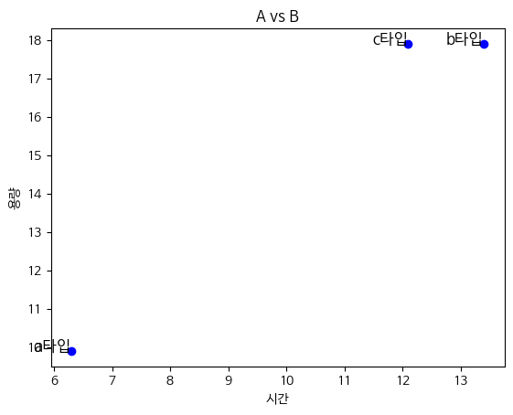

```python
----
layout:single
title:"판다스 자주 쓰는 것들"
---
```

### 해당 특정 폴더에 있는 엑셀 파일 불러들여서 합치고 저장


```python
import pandas as pd  
```


```python
import pandas as pd  
import numpy as np  
import glob  
import sys

#파일 Union  
all_data = pd.DataFrame()  
for f in glob.glob('C:\\Users\\kimjaehee\\MyPythonTest\\(연습)개인\\data_file/아파트(매매)_실거래가_*.xlsx'):
    df = pd.read_excel(f, skiprows=(16))  
    all_data = all_data.append(df, ignore_index=True)

#데이터갯수확인  
print(all_data.shape)

#데이터 잘 들어오는지 확인  
all_data.head()

#파일저장  
all_data.to_excel("C:\\Users\\kimjaehee\\MyPythonTest\\(연습)개인\\data_file/all.xlsx", index=False)
```

### 엑셀 관련 처리


```python
#읽기

pd.read_excel("data_file/all.xlsx")
# skiprows는 무시할 행 인덱스
d.read_excel(f, skiprows=(16))  
#저장
all_data.to_excel("C:\\Users\\kimjaehee\\MyPythonTest\\(연습)개인\\data_file/all.xlsx", index=False)
```

### 타입 변경


```python
#스트링 변경
h.astype({ '계약일' : 'string' })
```


```python
#datetime으로 변경
h["date"] = pd.to_datetime(h["date"],format='%Y%m%d')
```

### 조건 식


```python
condition = (h["계약일"].str.len() < 2)
```


```python
# 조건에 맞으면 스트링 을 한자리수 더함
c = h["condition"] == True
h.loc[c, '계약일'] = h["계약일"].str.zfill(2)
```

### 그래프 그리기


```python
d1 = hanshin_condition
d2 = wonam_condition

plt.figure(figsize=(10, 10))
plt.title('우남 59 - 한신 79 실거래가 비교')
plt.rcParams['font.family'] ='Malgun Gothic'
plt.rcParams['axes.unicode_minus'] =False
plt.plot(d1["date"], d1["거래금액(만원)"], color='red', marker='', alpha=0.5, linewidth=1)
#plt.plot(hils["date"], hils["거래금액(만원)"], color='blue', marker='', alpha=0.5, linewidth=1)
plt.plot(d2["date"], d2["거래금액(만원)"], color='blue', marker='', alpha=0.5, linewidth=1)
#plt.legend()
plt.xlabel('date')
plt.ylabel('거래금액(원)')

#h.plot(y=['date', '거래금액(만원)'], legend =False, logy=False, xlabel="date", ylabel="거래금액(만원)", grid=True, ms=10, figsize=(8,6))

#plt.axvspan("2022-09-01", "2022-11-22", facecolor='red', alpha=0.5)
#plt.axvspan("2022-11-23", "2022-11-30", facecolor='green', alpha=0.5)
```

## 참고 문서


```python
#엑셀 파일 합치는 법
#https://somjang.tistory.com/entry/Python-%EC%97%AC%EB%9F%AC-%EA%B0%9C%EC%9D%98-%EC%97%91%EC%85%80%ED%8C%8C%EC%9D%BC-%ED%95%98%EB%82%98%EB%A1%9C-%ED%95%A9%EC%B9%98%EB%8A%94-%EB%B0%A9%EB%B2%95-feat-pandas
```


```python
#판다스 관련 처리
#https://teddylee777.github.io/pandas/pandas-tutorial-03
```


```python
df = pd.DataFrame()
df
```


<div>
<style scoped>
    .dataframe tbody tr th:only-of-type {
        vertical-align: middle;
    }

    .dataframe tbody tr th {
        vertical-align: top;
    }

    .dataframe thead th {
        text-align: right;
    }
</style>
<table border="1" class="dataframe">
  <thead>
    <tr style="text-align: right;">
      <th></th>
    </tr>
  </thead>
  <tbody>
  </tbody>
</table>
</div>


```python
df = pd.DataFrame(index=range(0,1), columns = {'Date','덧셈',"뺄셈","곱셈"})
```


```python
df
```


<div>
<style scoped>
    .dataframe tbody tr th:only-of-type {
        vertical-align: middle;
    }

    .dataframe tbody tr th {
        vertical-align: top;
    }

    .dataframe thead th {
        text-align: right;
    }
</style>
<table border="1" class="dataframe">
  <thead>
    <tr style="text-align: right;">
      <th></th>
      <th>Date</th>
      <th>뺄셈</th>
      <th>곱셈</th>
      <th>덧셈</th>
    </tr>
  </thead>
  <tbody>
    <tr>
      <th>0</th>
      <td>NaN</td>
      <td>NaN</td>
      <td>NaN</td>
      <td>NaN</td>
    </tr>
  </tbody>
</table>
</div>


```python
df.loc[len(df)-1] = ["2022-01-01",1,2,3]
```


```python
df
```


<div>
<style scoped>
    .dataframe tbody tr th:only-of-type {
        vertical-align: middle;
    }

    .dataframe tbody tr th {
        vertical-align: top;
    }

    .dataframe thead th {
        text-align: right;
    }
</style>
<table border="1" class="dataframe">
  <thead>
    <tr style="text-align: right;">
      <th></th>
      <th>Date</th>
      <th>뺄셈</th>
      <th>곱셈</th>
      <th>덧셈</th>
    </tr>
  </thead>
  <tbody>
    <tr>
      <th>0</th>
      <td>2022-01-02</td>
      <td>1</td>
      <td>2</td>
      <td>3</td>
    </tr>
  </tbody>
</table>
</div>


```python
df.loc[len(df)] = ["2022-01-03",1,2,3]
```


```python
df
```


<div>
<style scoped>
    .dataframe tbody tr th:only-of-type {
        vertical-align: middle;
    }

    .dataframe tbody tr th {
        vertical-align: top;
    }

    .dataframe thead th {
        text-align: right;
    }
</style>
<table border="1" class="dataframe">
  <thead>
    <tr style="text-align: right;">
      <th></th>
      <th>Date</th>
      <th>뺄셈</th>
      <th>곱셈</th>
      <th>덧셈</th>
    </tr>
  </thead>
  <tbody>
    <tr>
      <th>0</th>
      <td>NaN</td>
      <td>NaN</td>
      <td>NaN</td>
      <td>NaN</td>
    </tr>
  </tbody>
</table>
</div>


```python
len(df)
```


    1


```python
df.loc[len(df)-1]["Date"] = "2022-12-24"
df.loc[len(df)-1]["덧셈"] = "2"
df.loc[len(df)-1]["뺄셈"] = "3"
df.loc[len(df)-1]["곱셈"] = "6"
```


```python
df
```


<div>
<style scoped>
    .dataframe tbody tr th:only-of-type {
        vertical-align: middle;
    }

    .dataframe tbody tr th {
        vertical-align: top;
    }

    .dataframe thead th {
        text-align: right;
    }
</style>
<table border="1" class="dataframe">
  <thead>
    <tr style="text-align: right;">
      <th></th>
      <th>Date</th>
      <th>뺄셈</th>
      <th>곱셈</th>
      <th>덧셈</th>
    </tr>
  </thead>
  <tbody>
    <tr>
      <th>0</th>
      <td>2022-12-24</td>
      <td>3</td>
      <td>6</td>
      <td>2</td>
    </tr>
  </tbody>
</table>
</div>


```python
len(df)
```


    1


```python
df.loc[len(df)-1]["곱셈"] = "4"
```


```python
df
```


<div>
<style scoped>
    .dataframe tbody tr th:only-of-type {
        vertical-align: middle;
    }

    .dataframe tbody tr th {
        vertical-align: top;
    }

    .dataframe thead th {
        text-align: right;
    }
</style>
<table border="1" class="dataframe">
  <thead>
    <tr style="text-align: right;">
      <th></th>
      <th>Date</th>
      <th>뺄셈</th>
      <th>곱셈</th>
      <th>덧셈</th>
    </tr>
  </thead>
  <tbody>
    <tr>
      <th>0</th>
      <td>2022-12-24</td>
      <td>3</td>
      <td>4</td>
      <td>2</td>
    </tr>
  </tbody>
</table>
</div>


```python
new_row = {'Date' : 4, '덧셈' : 0.7, "뺄셈":2, "곱셈":2}
```


```python
df.loc[1] = new_row
```


```python
df
```


<div>
<style scoped>
    .dataframe tbody tr th:only-of-type {
        vertical-align: middle;
    }

    .dataframe tbody tr th {
        vertical-align: top;
    }

    .dataframe thead th {
        text-align: right;
    }
</style>
<table border="1" class="dataframe">
  <thead>
    <tr style="text-align: right;">
      <th></th>
      <th>Date</th>
      <th>뺄셈</th>
      <th>곱셈</th>
      <th>덧셈</th>
    </tr>
  </thead>
  <tbody>
    <tr>
      <th>0</th>
      <td>2022-12-24</td>
      <td>3</td>
      <td>4</td>
      <td>2</td>
    </tr>
    <tr>
      <th>1</th>
      <td>4</td>
      <td>2</td>
      <td>2</td>
      <td>0.7</td>
    </tr>
  </tbody>
</table>
</div>


## matplotlib 폰트 안깨지게


```python
import matplotlib.pyplot as plt
import matplotlib.font_manager as fm

# 나눔글꼴 경로 설정
font_path = 'C:/Windows/Fonts/Hancom Gothic Bold.ttf'

# 폰트 이름 가져오기
font_name = fm.FontProperties(fname=font_path).get_name()

# 폰트 설정
plt.rc('font', family=font_name)
```

## 그래프 그리기


```python
import matplotlib.pyplot as plt

# 데이터
test_versions = ['a타입', 'b타입', 'c타입']
swf_values = [6.3, 13.4, 12.1]
load_time_values = [9.9, 17.9, 17.9]

# 산점도 그리기
plt.scatter(swf_values, load_time_values, color='b')

# 각 점에 대한 텍스트 추가
for i, version in enumerate(test_versions):
    plt.text(swf_values[i], load_time_values[i], version, fontsize=12, ha='right')

# 축 및 라벨 설정
plt.xlabel('시간')
plt.ylabel('용량')
plt.title('A vs B')

# 그래프 표시
plt.show()
```


    

    


## 기존 데이터 프레임에 컬럼 붙이기


```python
import pandas as pd

# 데이터프레임 생성
data = {'funcname': ['aa', 'bb', 'cc', 'dd', 'ee'],
        'count': [1, 2, 3, 4, 55]}

df = pd.DataFrame(data)

for index, row in df.iterrows():
    # 각 행에 대한 계산 로직을 여기에 추가
    print(row)
    df.at[index, "total"] = "11"

# 결과 출력
print(df, df.shape)


total_values = [1, 2, 3, 4, 5]
df['total'] = total_values

print(df, df.shape)
```

    funcname    aa
    count        1
    Name: 0, dtype: object
    funcname    bb
    count        2
    Name: 1, dtype: object
    funcname    cc
    count        3
    Name: 2, dtype: object
    funcname    dd
    count        4
    Name: 3, dtype: object
    funcname    ee
    count       55
    Name: 4, dtype: object
      funcname  count total
    0       aa      1    11
    1       bb      2    11
    2       cc      3    11
    3       dd      4    11
    4       ee     55    11 (5, 3)
      funcname  count  total
    0       aa      1      1
    1       bb      2      2
    2       cc      3      3
    3       dd      4      4
    4       ee     55      5 (5, 3)
    


```python

```
