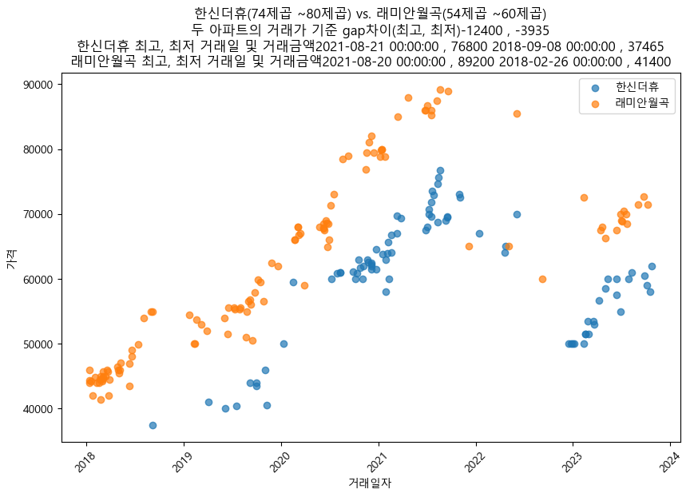

```python
"""
----
layout:single
title:"부동산데이터조회"
---
"""
```


```python
import PublicDataReader as pdr
from PublicDataReader import TransactionPrice
import pandas as pd
import matplotlib.pyplot as plt
import matplotlib.font_manager as fm

#service_key = "yiR0b8EjzMtPXZXA4rkecmLa2tLQz3as8Ws8Xv8YZKy754cMadMP43Wg3EsPgw03C2yU5WdHbnySvOZZQlwPfA%3D%3D"
#지수
service_key ="X3vzw0653nKqDzqCzCOlotaLcfj%2BNM%2B4SKaQvtApBNBmMoOp5tfBFyh%2BrzzLBVrxWZYW0d0%2BrmhYrm9tJkdbgA%3D%3D"
api = TransactionPrice(service_key)
print(api)
sigungu_name = "화성시"
dong_name = ""
code = pdr.code_bdong()
code.loc[(code['시군구명'].str.contains(sigungu_name)) &
         (code['읍면동명']==dong_name)]

get_gu_list = [
        "화성시", "용인시", "수원시",
        "강남구", "강동구", "강북구", "강서구", "관악구",
        "광진구", "구로구", "금천구", "노원구", "도봉구",
        "동대문구", "동작구", "마포구", "서대문구", "서초구",
        "성동구", "성북구", "송파구", "양천구", "영등포구",
        "용산구", "은평구", "종로구", "중구", "중랑구"
    ]


# 나눔글꼴 경로 설정
font_path = 'C:/Windows/Fonts/Hancom Gothic Bold.ttf'
# 폰트 이름 가져오기
font_name = fm.FontProperties(fname=font_path).get_name()
# 폰트 설정
plt.rc('font', family=font_name)

def get_sigun_code(name):
    dong_name = ""
    code = pdr.code_bdong()
    df = code.loc[(code['시군구명'].str.contains(name)) & (code['읍면동명'] == dong_name)]
    return df

def get_apt_name(code, name, start, end, use_csv = False):
    if use_csv == True:
        print("DogRealLand::get_apt_name::데이터 있는 데이터로 가져온다")
        df = pd.read_csv(code + "_land.csv", encoding="utf-8")
    else:
        print("DogRealLand::get_apt_name::데이터 새로 가져온다", code, name)
        # 특정 기간 자료 조회하기
        df = api.get_data(
            property_type="아파트",
            trade_type="매매",
            sigungu_code=code,
            start_year_month=start,
            end_year_month=end
        )   
        
    return df[df["아파트"].str.contains(name)]

def search(code, start, end, use_csv=False):
    df = []
    select = []

    if use_csv == True:
        print("DogRealLand::search::데이터 있는 데이터로 가져온다")
        select = pd.read_csv(code + "_land.csv", encoding="utf-8")
    else:
        print("DogRealLand::search::데이터 새로 가져온다")
        # 특정 기간 자료 조회하기
        df = api.get_data(
            property_type="아파트",
            trade_type="매매",
            sigungu_code=code,
            start_year_month=start,
            end_year_month=end,
        )

        # select = df[df["법정동"] == "목동"][["아파트", "법정동", "거래금액", "층", "전용면적", "년", "월", "일"]]
        select = df[["아파트", "법정동", "거래금액", "층", "전용면적", "년", "월", "일"]]

    print("거래건수", len(select))

    select["월"] = select["월"].astype(str).str.zfill(2)
    select["일"] = select["일"].astype(str).str.zfill(2)

    # select["거래일자"] = pd.to_datetime(select[["년", "월", "일"]].astype(str
    # ).apply(lambda x: '-'.join(x)), format="%Y-%m-%d")
    select["거래일자"] = pd.to_datetime(select[["년", "월", "일"]].astype(str).agg('-'.join, axis=1), format="%Y-%m-%d")
    return select


def diff(first_apt_df, second_apt_df, first_apt_name, second_apt_name, first_size_min, first_size_max, second_size_min, second_size_max):
    # 나눔글꼴 경로 설정
    font_path = 'C:/Windows/Fonts/malgun.ttf'
    # 폰트 이름 가져오기
    font_name = fm.FontProperties(fname=font_path).get_name()
    # 폰트 설정
    plt.rc('font', family=font_name)

    # 아파트 1과 아파트 2 데이터 선택
    apt1_select = first_apt_df[(first_apt_df["아파트"] == first_apt_name) & (first_apt_df["전용면적"].astype(float) >= first_size_min) & (
                first_apt_df["전용면적"].astype(float) < first_size_max)]
    apt2_select = second_apt_df[(second_apt_df["아파트"] == second_apt_name) & (second_apt_df["전용면적"].astype(float) >= second_size_min) & (
                second_apt_df["전용면적"].astype(float) < second_size_max)]

    # 거래금액 상위 10
    print(first_apt_name, apt1_select["거래금액"].max())
    print(second_apt_name, apt2_select["거래금액"].max())

    gap_max = apt1_select["거래금액"].max() - apt2_select["거래금액"].max()
    gap_min = apt1_select["거래금액"].min() - apt2_select["거래금액"].min()
    print("갭차이최고:", gap_max)
    print("갭차이최저:", gap_min)

    #max_index = first_apt_df["거래금액"]
    #max_date = apt1_select.loc[max_index, ["년", "월", "일"]]

    first_max = apt1_select[(apt1_select["거래금액"] == apt1_select["거래금액"].max())][["거래일자", "거래금액"]]
    second_max = apt2_select[(apt2_select["거래금액"] == apt2_select["거래금액"].max())][["거래일자", "거래금액"]]
    first_min = apt1_select[(apt1_select["거래금액"] == apt1_select["거래금액"].min())][["거래일자", "거래금액"]]
    second_min = apt2_select[(apt2_select["거래금액"] == apt2_select["거래금액"].min())][["거래일자", "거래금액"]]

    print(first_apt_name, "최고거래일", first_max)
    print(second_apt_name, "최고거래일", second_max)

    print(first_apt_name, "최저거래일", first_min)
    print(second_apt_name, "최저거래일", second_min)

    # 그래프 그리기
    plt.figure(figsize=(10, 6))

    # plt.plot(apt1_select["거래일자"], apt1_select["거래금액"], label="힐스테이트동탄")
    # plt.plot(apt2_select["거래일자"], apt2_select["거래금액"], label="한신더휴")
    plt.scatter(apt1_select["거래일자"], apt1_select["거래금액"], label=first_apt_name, alpha=0.7)
    plt.scatter(apt2_select["거래일자"], apt2_select["거래금액"], label=second_apt_name, alpha=0.7)

    plt.title(first_apt_name + "(" + str(first_size_min) + "제곱 ~" + str(first_size_max) + "제곱) vs. " + str(
            second_apt_name) + "(" + str(second_size_min) + "제곱 ~" + str(
            second_size_max) + "제곱)" + "\n두 아파트의 거래가 기준 gap차이(최고, 최저)" + str(gap_max) + " , " + str(gap_min) + "\n"
            + first_apt_name + " 최고, 최저 거래일 및 거래금액" + str(first_max.iloc[0][0]) + " , " +str(first_max.iloc[0][1]) + " "
            + str(first_min.iloc[0][0]) + " , " + str(first_min.iloc[0][1]) + "\n"
            + second_apt_name + " 최고, 최저 거래일 및 거래금액" + str(second_max.iloc[0][0]) + " , " +str(second_max.iloc[0][1]) + " "
            + str(second_min.iloc[0][0]) + " , " + str(second_min.iloc[0][1])
        )
    plt.xlabel("거래일자")
    plt.ylabel("가격")
    plt.legend()
    plt.xticks(rotation=45)
    plt.show()
    #plt.savefig(Engine.get_current_image_path() + "image.png")
    
def get_data_to_csv(code):
    df = search(code, "201701", "202312")
    df.to_csv(code + "_land.csv", index=False, encoding='utf-8-sig', header=True)

def test():
    return
    global df
    
    df = search("41590", "201801", "202312", True)
    print(df)
    count_stats = df.groupby('법정동').size().reset_index(name='거래건수')
    print(count_stats)
    
    return   

    
    
    
test()
```

    <PublicDataReader.PublicDataPortal.molit.TransactionPrice object at 0x00000228BD8CAE20>
    출처: 행정기관(행정동) 및 관할구역(법정동) 변경내역(2023.10.30. 시행)
    


```python
#df = search("41590", "201801", "202312", True)
#print(df)

start_date = "2023-01-01"
end_date = "2023-12-31"


#아파트명 검색
def check_0():    
    df = get_apt_name("41590", "우남", "202301", "202312", True)[["아파트", "거래금액", "년", "월", "일", "전용면적"]].sort_values(by=["거래금액"], ascending=True)
    print(df)
    
# 성북구 래미안 아파트로 202310~202312월까지 조회해서 전용면적이 40보다 크고 90보다 작은 리스트
def check_1(code, keyword, start, end, min_size, max_size):    
    d = get_apt_name(code, keyword, start, end, True)[["아파트", "거래금액", "년", "월", "일", "전용면적"]]
    e = d[(d["전용면적"].astype(float) > min_size) & (d["전용면적"].astype(float) < max_size)]
    print(e.sort_values(by=["거래금액"], ascending=True).head())


#거래건수 정렬(법정동, 거래건수)
def check0():
    sort_df = df[(df["거래일자"] >= start_date) & (df["거래일자"] <= end_date)]
    count_stats = sort_df.groupby('법정동').size().reset_index(name='거래건수')
    a = count_stats.sort_values(by="거래건수", ascending=False)
    print(a)

#특정동 거래건수(아파트, 거래건수)
def check1(dong_name):
    sort_df = df[(df["법정동"] == dong_name) & (df["거래일자"] >= start_date) & (df["거래일자"] <= end_date)]
    count_stats = sort_df.groupby('아파트').size().reset_index(name='거래건수')
    a = count_stats.sort_values(by="거래건수", ascending=False)
    print(a)
    

#거래건수가 많은 월 파악
def check2(apt_name, dong_name):
    sort_df = df[(df["아파트"] == apt_name) & (df["법정동"] == dong_name) & (df["거래일자"] >= start_date) & (df["거래일자"] <= end_date)]
    count_stats = sort_df.groupby(["월"]).size().reset_index(name='거래건수')
    #count_stats.sort_values(by="거래일자", ascending=True)
    print(count_stats)
    plt.figure(figsize=(13, 8))
    #plt.scatter(count_stats["월"], count_stats["거래건수"], label="", alpha=0.7)
    plt.plot(count_stats["월"], count_stats["거래건수"], label="", alpha=0.7)
    plt.xlabel("거래일자")
    plt.ylabel("거래건수")
    plt.title(apt_name)
    plt.legend()
    plt.xticks(rotation=45)
    plt.show()
    
def check3():
    
    # 한신더휴와 래미안월곡 아파트의 18년도부터 비교
    first_df = search("41590", "201701", "202312", True)
    second_df = search("11290", "201701", "202312", True)
    diff(first_df, second_df, "한신더휴", "래미안월곡", 74, 80, 54, 60)

    # 한신더휴와 반도3차 아파트의 18년도부터 비교(같은 지역이면 하나만)
    #first_df = dog.search("41590", "201801", "202312")
    #second_df = dog.search("41590", "201801", "202312")
    #dog.diff(first_df, first_df, "한신더휴", "반도유보라아이비파크3", 74, 80, 70, 80)
    
    return
    
    first_df = search("41590", "201801", "202312", True)    
    second_df = search("41173", "201801", "202312", True)        
    diff(first_df, second_df, "동탄역 시범우남퍼스트빌아파트", "인덕원마을(삼성)", 55, 60, 55, 60)
    
def check4():
    #print(get_sigun_code("오산시"))
    
    #return

    #화성시
    get_data_to_csv("41590")
    #성북구
    get_data_to_csv("11290")
    #오산시
    get_data_to_csv("41370")
    #중구
    get_data_to_csv("11140")
    #성동구
    get_data_to_csv("11200")
    #안양 만안구
    get_data_to_csv("41173")
    #의왕시
    get_data_to_csv("41430")
    
check3()
#check_0()
#check4()
#check_1("41590", "반도", start_date, end_date, 50, 100)
#check1("청계동")
#check2("동탄역 시범우남퍼스트빌아파트", "청계동")
```

    DogRealLand::search::데이터 있는 데이터로 가져온다
    거래건수 61521
    DogRealLand::search::데이터 있는 데이터로 가져온다
    거래건수 17868
    한신더휴 76800
    래미안월곡 89200
    갭차이최고: -12400
    갭차이최저: -3935
    한신더휴 최고거래일             거래일자   거래금액
    47036 2021-08-21  76800
    래미안월곡 최고거래일             거래일자   거래금액
    15052 2021-08-20  89200
    한신더휴 최저거래일            거래일자   거래금액
    7203 2018-09-08  37465
    래미안월곡 최저거래일            거래일자   거래금액
    1215 2018-02-26  41400
    


    

    

