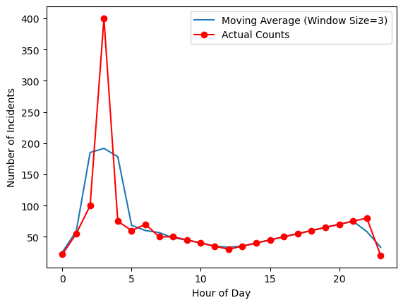
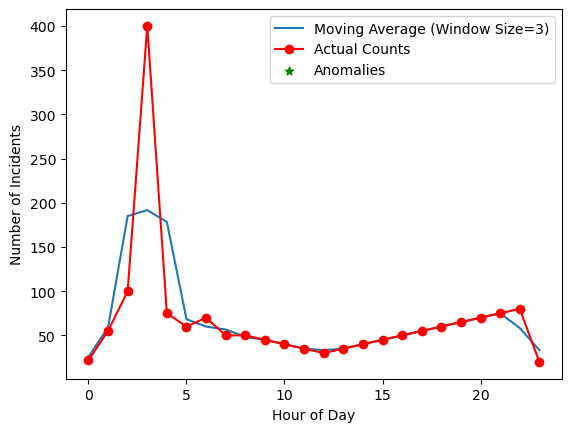

```python
"""
----
layout:single
title:"이동평균선"
---
"""
```


```python
import numpy as np
import matplotlib.pyplot as plt

# 시간대와 건수 데이터 (예시)
hours = np.arange(24)
counts = np.array([22, 55, 100, 400, 75, 60, 70, 50, 50, 45, 40, 35, 30, 35, 40, 45, 50, 55, 60, 65, 70, 75, 80, 20])

# 이동평균 계산 함수
def moving_average(data, window_size):
    # 이동평균을 계산하는 함수, np.convolve를 사용하여 윈도우 크기에 대한 이동평균을 구함
    return np.convolve(data, np.ones(window_size)/window_size, mode='same')

# 이동평균과 실제 건수 데이터 시각화
#window_size는 이동평균을 계산할 때 사용되는 윈도우(창)의 크기를 나타냅니다. 이것은 몇 개의 연속된 데이터 포인트를 사용하여 평균을 계산할지 결정합니다.
#예를 들어 window_size가 3인 경우, 현재 시간대와 그 전후의 2개의 시간대를 포함한 총 3개의 시간대 데이터를 사용하여 이동평균을 계산합니다. 이렇게 3시간의 데이터를 이용하면 현재 시간대의 값과 그 전후 시간대의 값을 평균내어 부드러운 추세를 나타내는 값이 얻어집니다.
#만약 window_size를 더 크게 설정하면 더 많은 데이터를 사용하여 이동평균이 계산되며, 이는 추세를 더욱 부드럽게 만들 수 있습니다. 그러나 동시에 더 큰 윈도우 크기는 빠른 변화를 감지하는 데 어려움을 줄 수 있습니다. 반대로 작은 윈도우 크기는 빠른 변화를 잘 감지하지만 노이즈에 민감해질 수 있습니다.
#따라서 window_size를 설정할 때는 데이터의 특성과 감지하려는 변화의 크기에 따라 적절한 값을 선택하는 것이 중요합니다.
window_size = 3
moving_avg = moving_average(counts, window_size)

# 실제 데이터와 이동평균을 시각화
plt.plot(hours, moving_avg, label=f'Moving Average (Window Size={window_size})')
plt.plot(hours, counts, marker='o', linestyle='-', color='r', label='Actual Counts')
plt.xlabel('Hour of Day')
plt.ylabel('Number of Incidents')
plt.legend()
plt.show()

# 특이점 감지
#threshold는 특이점(이상치)을 감지하기 위한 임계값을 나타냅니다. 특이점 감지에서 임계값은 이동평균과 실제 데이터 간의 차이가 얼마나 커야 특이점으로 간주할지를 결정하는데 사용됩니다.
#예를 들어 threshold = 2.0라면, 이 코드에서는 현재 시간대의 건수가 이동평균보다 2배 이상 큰 경우를 특이점으로 간주합니다. 이는 데이터가 일정한 추세에서 크게 벗어난 경우를 감지하도록 합니다. 만약 임계값을 낮추면 더 많은 특이점이 감지되고, 임계값을 높이면 감지되는 특이점이 줄어듭니다.
#임계값은 데이터의 특성과 감지하려는 특이점의 크기에 따라 조절되어야 하며, 이 값이 너무 낮거나 높으면 원하는 특이점을 감지하지 못하거나 너무 많은 특이점을 감지할 수 있습니다. 따라서 임계값 설정에는 신중함이 필요합니다.
threshold = 2.0
#np.where는 NumPy에서 배열에서 조건을 만족하는 요소의 인덱스를 찾는 데 사용되는 함수입니다. 이 함수는 배열의 조건을 검사하고 조건을 만족하는 요소의 인덱스를 반환합니다.
anomalies = np.where(counts > threshold * moving_avg)[0]

# 특이점 시각화
plt.plot(hours, moving_avg, label=f'Moving Average (Window Size={window_size})')
plt.plot(hours, counts, marker='o', linestyle='-', color='r', label='Actual Counts')
plt.scatter(anomalies, counts[anomalies], color='g', marker='*', label='Anomalies')
plt.xlabel('Hour of Day')
plt.ylabel('Number of Incidents')
plt.legend()
plt.show()

# 특이점 출력
if len(anomalies) > 0:
    print(f'Anomalies detected at hours: {anomalies}')
else:
    print('No anomalies detected.')

```


    

    


    

    


    Anomalies detected at hours: [3]
    
