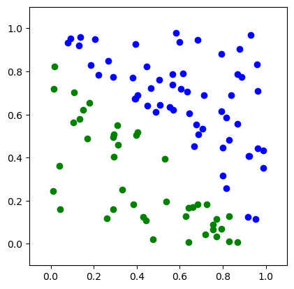

```python
"""
----
layout:single
title:"퍼셉트론"
---
"""
```


```python
https://www.youtube.com/watch?v=YODTXF9OIiw&t=10s
```


```python
import numpy as np
import matplotlib.pyplot as plt
from IPython.display import clear_output
```


```python
def step_function(x):
    if x < thres:
        return 0
    else:
        return 1    
```


```python
#랜덤으로 트레이닝 데이터
def gen_training_data(data_point):
    #0부터 1까지 무작위
    x1=np.random.random(data_point)
    x2=np.random.random(data_point)
    #더해서 1보다 크면 비가 오고 작으면 맑음
    y = ((x1 + x2) > 1).astype(int)
    training_set = [((x1[i], x2[i]), y[i]) for i in range(len(x1))]
    
    return training_set
```


```python
#역치
thres = 0.5
#연결 가중치
w = np.array([0.3, 0])
lr = 0.1
data_point = 100
#반복
epoch =10
training_set = gen_training_data(data_point)
```


```python
training_set
```


    [((0.6822549301924448, 0.1847264909655446), 0),
     ((0.6760066268381526, 0.5519123236241866), 1),
     ((0.9159094498836332, 0.12387132642984255), 1),
     ((0.95934972247811, 0.8310974578873687), 1),
     ((0.8674728794968244, 0.009600565207520062), 0),
     ((0.6135200243612917, 0.7893346510038929), 1),
     ((0.17877916693554308, 0.6547476672508583), 0),
     ((0.6405322259804398, 0.009564705028393017), 0),
     ((0.7253288974141009, 0.1824542064427308), 0),
     ((0.5520807786865469, 0.6352770322078952), 1),
     ((0.3935352392573993, 0.9254664116022361), 1),
     ((0.9607673495014744, 0.7084658788990374), 1),
     ((0.09182551666175387, 0.953479699991234), 1),
     ((0.22079392616768234, 0.7837438448598398), 1),
     ((0.5693937168848578, 0.6210908915709646), 1),
     ((0.3943098353184217, 0.6723085527159992), 1),
     ((0.7559092483154501, 0.08904153811018545), 0),
     ((0.7940490707820941, 0.6143557332564349), 1),
     ((0.53157840777087, 0.39520670528299884), 0),
     ((0.9219862147170785, 0.40661197124438075), 1),
     ((0.29120570531524803, 0.49402025629084845), 0),
     ((0.15206517459189672, 0.6208151070185507), 0),
     ((0.5076643812814255, 0.6440661891806033), 1),
     ((0.31421937090402186, 0.45868518698943705), 0),
     ((0.466303005924406, 0.7225586084401556), 1),
     ((0.7697681596363442, 0.11629459595373903), 0),
     ((0.961930819537381, 0.442261711944665), 1),
     ((0.13908992803469122, 0.958725364660665), 1),
     ((0.8693586105238249, 0.5576718040206947), 1),
     ((0.6670574185303733, 0.45302755023151087), 1),
     ((0.2902709272401184, 0.1599980374541169), 0),
     ((0.8158531120612642, 0.2580169956849889), 1),
     ((0.8784329471171702, 0.9031743266394283), 1),
     ((0.6593996087905776, 0.1706375000705712), 0),
     ((0.039023155959045486, 0.36168501612565107), 0),
     ((0.39861573681779217, 0.5052007597293616), 0),
     ((0.04256251006802447, 0.1605804005560767), 0),
     ((0.4418370322246348, 0.10748210205901865), 0),
     ((0.8277435015512203, 0.4814750179918911), 1),
     ((0.8374064777963586, 0.6909039040820141), 1),
     ((0.8002979152638555, 0.3166733330973788), 1),
     ((0.2058971419130955, 0.9490331960820314), 1),
     ((0.7693645257948791, 0.0329055196336826), 0),
     ((0.10450441214136996, 0.5619447915874178), 0),
     ((0.6332809880776591, 0.7064511605221862), 1),
     ((0.010324898990511588, 0.24643123560611768), 0),
     ((0.5676029200121967, 0.7401849906664174), 1),
     ((0.4452303594503131, 0.8235192323818301), 1),
     ((0.7108975820736662, 0.6884918965327612), 1),
     ((0.7066502350745341, 0.5350523879490403), 1),
     ((0.7921367789890567, 0.8826702590463777), 1),
     ((0.13334624642834825, 0.5780245762321579), 0),
     ((0.12984247574743657, 0.9200380984524353), 1),
     ((0.1873311286987459, 0.8295056673947772), 1),
     ((0.2945593729535887, 0.40563520891614335), 0),
     ((0.5831061638179454, 0.9785183330738907), 1),
     ((0.48720662280681826, 0.6131157702125261), 1),
     ((0.10821932517125854, 0.704027392220806), 0),
     ((0.017916144785823707, 0.8216997979147389), 0),
     ((0.4475976432450516, 0.639828902365449), 1),
     ((0.8172966004587767, 0.5853162788302388), 1),
     ((0.28977821442568963, 0.773408159013657), 1),
     ((0.5042933327325715, 0.7616181831705165), 1),
     ((0.29272322676073603, 0.5082008303579649), 0),
     ((0.42930735824877697, 0.126484788153846), 0),
     ((0.380350731323162, 0.7718654156339584), 1),
     ((0.6417685182511458, 0.16815907464635915), 0),
     ((0.47362107897529426, 0.02143672885001735), 0),
     ((0.07928200540526842, 0.9330527978673899), 1),
     ((0.9527188058007966, 0.1136466884184072), 1),
     ((0.38969519950501996, 0.6750818581660301), 1),
     ((0.7545783118642047, 0.06747447394990302), 0),
     ((0.7938122815973491, 0.06819006078370937), 0),
     ((0.828644557863453, 0.1296583835482057), 0),
     ((0.2680703472635282, 0.8483722717681054), 1),
     ((0.310535847354792, 0.5516145228690893), 0),
     ((0.9309889837887464, 0.967759651252406), 1),
     ((0.9888647621974578, 0.4333670755745448), 1),
     ((0.4042088144745598, 0.5193756043280722), 0),
     ((0.6277663817060277, 0.12837118966316052), 0),
     ((0.8289626063775754, 0.009869371573025032), 0),
     ((0.7177622949591022, 0.04432237977420539), 0),
     ((0.3309734019238575, 0.25242770193996733), 0),
     ((0.26119337585976854, 0.12002768288609689), 0),
     ((0.8692966498690884, 0.7875821058465117), 1),
     ((0.4042322289640813, 0.6901863836376676), 1),
     ((0.5354748269429086, 0.19589644059774314), 0),
     ((0.9881055373065929, 0.3523537512280286), 1),
     ((0.6038300249696522, 0.718326321125081), 1),
     ((0.9209413305096278, 0.4081583596340287), 1),
     ((0.6850503737443899, 0.5066807770809599), 1),
     ((0.38300629633768446, 0.18175610839785616), 0),
     ((0.015558976326464857, 0.7190717175203412), 0),
     ((0.887496308142531, 0.7732162013383458), 1),
     ((0.5971858003769188, 0.9351736303288807), 1),
     ((0.800699834602845, 0.4462073830159565), 1),
     ((0.1704326987195629, 0.48989493002212947), 0),
     ((0.5661275252124669, 0.7873510025316627), 1),
     ((0.6831594711864905, 0.9466874072508857), 1),
     ((0.6433218779270451, 0.6062268218087664), 1)]


```python
training_set[0:5]
```


    [((0.6822549301924448, 0.1847264909655446), 0),
     ((0.6760066268381526, 0.5519123236241866), 1),
     ((0.9159094498836332, 0.12387132642984255), 1),
     ((0.95934972247811, 0.8310974578873687), 1),
     ((0.8674728794968244, 0.009600565207520062), 0)]


```python
plt.figure(0)
#데이터의 범위가 0부터 1사이이기때문에 마진을 주기 위해
plt.ylim(-0.1, 1.1)
plt.xlim(-0.1, 1.1)
ax=plt.gca()
ax.set_aspect("equal", adjustable="box")

for x, y in training_set:
    #비가 온다면
    if y == 1:
        plt.plot(x[0], x[1], "bo")
    else:
        plt.plot(x[0], x[1], "go")
        
plt.show()
```


    

    


```python
for x, y in training_set:
    print(x[1], y)
```

    0.1847264909655446 0
    0.5519123236241866 1
    0.12387132642984255 1
    0.8310974578873687 1
    0.009600565207520062 0
    0.7893346510038929 1
    0.6547476672508583 0
    0.009564705028393017 0
    0.1824542064427308 0
    0.6352770322078952 1
    0.9254664116022361 1
    0.7084658788990374 1
    0.953479699991234 1
    0.7837438448598398 1
    0.6210908915709646 1
    0.6723085527159992 1
    0.08904153811018545 0
    0.6143557332564349 1
    0.39520670528299884 0
    0.40661197124438075 1
    0.49402025629084845 0
    0.6208151070185507 0
    0.6440661891806033 1
    0.45868518698943705 0
    0.7225586084401556 1
    0.11629459595373903 0
    0.442261711944665 1
    0.958725364660665 1
    0.5576718040206947 1
    0.45302755023151087 1
    0.1599980374541169 0
    0.2580169956849889 1
    0.9031743266394283 1
    0.1706375000705712 0
    0.36168501612565107 0
    0.5052007597293616 0
    0.1605804005560767 0
    0.10748210205901865 0
    0.4814750179918911 1
    0.6909039040820141 1
    0.3166733330973788 1
    0.9490331960820314 1
    0.0329055196336826 0
    0.5619447915874178 0
    0.7064511605221862 1
    0.24643123560611768 0
    0.7401849906664174 1
    0.8235192323818301 1
    0.6884918965327612 1
    0.5350523879490403 1
    0.8826702590463777 1
    0.5780245762321579 0
    0.9200380984524353 1
    0.8295056673947772 1
    0.40563520891614335 0
    0.9785183330738907 1
    0.6131157702125261 1
    0.704027392220806 0
    0.8216997979147389 0
    0.639828902365449 1
    0.5853162788302388 1
    0.773408159013657 1
    0.7616181831705165 1
    0.5082008303579649 0
    0.126484788153846 0
    0.7718654156339584 1
    0.16815907464635915 0
    0.02143672885001735 0
    0.9330527978673899 1
    0.1136466884184072 1
    0.6750818581660301 1
    0.06747447394990302 0
    0.06819006078370937 0
    0.1296583835482057 0
    0.8483722717681054 1
    0.5516145228690893 0
    0.967759651252406 1
    0.4333670755745448 1
    0.5193756043280722 0
    0.12837118966316052 0
    0.009869371573025032 0
    0.04432237977420539 0
    0.25242770193996733 0
    0.12002768288609689 0
    0.7875821058465117 1
    0.6901863836376676 1
    0.19589644059774314 0
    0.3523537512280286 1
    0.718326321125081 1
    0.4081583596340287 1
    0.5066807770809599 1
    0.18175610839785616 0
    0.7190717175203412 0
    0.7732162013383458 1
    0.9351736303288807 1
    0.4462073830159565 1
    0.48989493002212947 0
    0.7873510025316627 1
    0.9466874072508857 1
    0.6062268218087664 1
    


```python
%matplotlib inline
from time import sleep

plt.figure(0)
#데이터의 범위가 0부터 1사이이기때문에 마진을 주기 위해
plt.ylim(-0.1, 1.1)
plt.xlim(-0.1, 1.1)
ax=plt.gca()
ax.set_aspect("equal", adjustable="box")

#1차함수를 구하기 위해
xx = np.linspace(0, 1, 50)
for i in range(epoch):
    cnt = 0
    for x, y in training_set:
        clear_output(wait=True)   
        #입력값과 연결가중치를 곱해서 더한것
        u = sum(x*w)
        #실제값과 계산된값이 오차이다.
        error = y - step_function(u)
        for index, value in enumerate(x):
            #새연결강도=현연결강도+현입력값x오차x학습률
            w[index] = w[index] + lr*error*value
            
        for xs, ys in training_set[0:cnt]:
            plt.ylim(-0.1, 1.1)
            plt.xlim(-0.1, 1.1)
            ax = plt.gca()
            ax.set_aspect("equal", adjustable="box")
            if ys == 1:
                plt.plot(xs[0], xs[1], "bo")
            else:
                plt.plot(xs[0], xs[1], "go")
        #일차 함수 공식
        yy = -w[1]/w[0] * xx + thres/w[0]   # <=== w[0]*yy + w[1]*xx = thres
        
        plt.plot(xx, yy)
        plt.show()
        cnt = cnt+1
        sleep(0.01)
        
```


    ---------------------------------------------------------------------------

    KeyboardInterrupt                         Traceback (most recent call last)

    ~\AppData\Local\Temp\ipykernel_22048\548335121.py in <module>
         24 
         25         for xs, ys in training_set[0:cnt]:
    ---> 26             plt.ylim(-0.1, 1.1)
         27             plt.xlim(-0.1, 1.1)
         28             ax = plt.gca()
    

    ~\anaconda3\lib\site-packages\matplotlib\pyplot.py in ylim(*args, **kwargs)
       1752     `~.Axes.set_ylim` on the current axes. All arguments are passed though.
       1753     """
    -> 1754     ax = gca()
       1755     if not args and not kwargs:
       1756         return ax.get_ylim()
    

    ~\anaconda3\lib\site-packages\matplotlib\pyplot.py in gca(**kwargs)
       2272 @_copy_docstring_and_deprecators(Figure.gca)
       2273 def gca(**kwargs):
    -> 2274     return gcf().gca(**kwargs)
       2275 
       2276 
    

    ~\anaconda3\lib\site-packages\matplotlib\figure.py in gca(self, **kwargs)
       1565                 "plt.subplot().")
       1566         if self._axstack.empty():
    -> 1567             return self.add_subplot(1, 1, 1, **kwargs)
       1568         else:
       1569             return self._axstack()
    

    ~\anaconda3\lib\site-packages\matplotlib\figure.py in add_subplot(self, *args, **kwargs)
        770             projection_class, pkw = self._process_projection_requirements(
        771                 *args, **kwargs)
    --> 772             ax = subplot_class_factory(projection_class)(self, *args, **pkw)
        773             key = (projection_class, pkw)
        774         return self._add_axes_internal(ax, key)
    

    ~\anaconda3\lib\site-packages\matplotlib\axes\_subplots.py in __init__(self, fig, *args, **kwargs)
         32         """
         33         # _axes_class is set in the subplot_class_factory
    ---> 34         self._axes_class.__init__(self, fig, [0, 0, 1, 1], **kwargs)
         35         # This will also update the axes position.
         36         self.set_subplotspec(SubplotSpec._from_subplot_args(fig, args))
    

    ~\anaconda3\lib\site-packages\matplotlib\_api\deprecation.py in wrapper(*args, **kwargs)
        457                 "parameter will become keyword-only %(removal)s.",
        458                 name=name, obj_type=f"parameter of {func.__name__}()")
    --> 459         return func(*args, **kwargs)
        460 
        461     # Don't modify *func*'s signature, as boilerplate.py needs it.
    

    ~\anaconda3\lib\site-packages\matplotlib\axes\_base.py in __init__(self, fig, rect, facecolor, frameon, sharex, sharey, label, xscale, yscale, box_aspect, **kwargs)
        630 
        631         self._rasterization_zorder = None
    --> 632         self.cla()
        633 
        634         # funcs used to format x and y - fall back on major formatters
    

    ~\anaconda3\lib\site-packages\matplotlib\axes\_base.py in cla(self)
       1299         self.set_axis_on()
       1300 
    -> 1301         self.xaxis.set_clip_path(self.patch)
       1302         self.yaxis.set_clip_path(self.patch)
       1303 
    

    ~\anaconda3\lib\site-packages\matplotlib\axis.py in set_clip_path(self, clippath, transform)
        933 
        934     def set_clip_path(self, clippath, transform=None):
    --> 935         super().set_clip_path(clippath, transform)
        936         for child in self.majorTicks + self.minorTicks:
        937             child.set_clip_path(clippath, transform)
    

    ~\anaconda3\lib\site-packages\matplotlib\artist.py in set_clip_path(self, path, transform)
        788             if isinstance(path, Rectangle):
        789                 self.clipbox = TransformedBbox(Bbox.unit(),
    --> 790                                                path.get_transform())
        791                 self._clippath = None
        792                 success = True
    

    ~\anaconda3\lib\site-packages\matplotlib\patches.py in get_transform(self)
        276     def get_transform(self):
        277         """Return the `~.transforms.Transform` applied to the `Patch`."""
    --> 278         return self.get_patch_transform() + artist.Artist.get_transform(self)
        279 
        280     def get_data_transform(self):
    

    ~\anaconda3\lib\site-packages\matplotlib\patches.py in get_patch_transform(self)
        758         bbox = self.get_bbox()
        759         return (transforms.BboxTransformTo(bbox)
    --> 760                 + transforms.Affine2D().rotate_deg_around(
        761                     bbox.x0, bbox.y0, self.angle))
        762 
    

    ~\anaconda3\lib\site-packages\matplotlib\transforms.py in rotate_deg_around(self, x, y, degrees)
       2040         # Cast to float to avoid wraparound issues with uint8's
       2041         x, y = float(x), float(y)
    -> 2042         return self.translate(-x, -y).rotate_deg(degrees).translate(x, y)
       2043 
       2044     def translate(self, tx, ty):
    

    ~\anaconda3\lib\site-packages\matplotlib\transforms.py in rotate_deg(self, degrees)
       2018         and :meth:`scale`.
       2019         """
    -> 2020         return self.rotate(math.radians(degrees))
       2021 
       2022     def rotate_around(self, x, y, theta):
    

    ~\anaconda3\lib\site-packages\matplotlib\transforms.py in rotate(self, theta)
       2006         rotate_mtx = np.array([[a, -b, 0.0], [b, a, 0.0], [0.0, 0.0, 1.0]],
       2007                               float)
    -> 2008         self._mtx = np.dot(rotate_mtx, self._mtx)
       2009         self.invalidate()
       2010         return self
    

    <__array_function__ internals> in dot(*args, **kwargs)
    

    KeyboardInterrupt: 


    <Figure size 640x480 with 0 Axes>


```python
#거의 0.5에 수렴
w[1]
```


    0.5075003396488031


```python
#거의 0.5에 수렴
w[0]
```


    0.5087276035428193


```python
yy = 
```


```python

```
