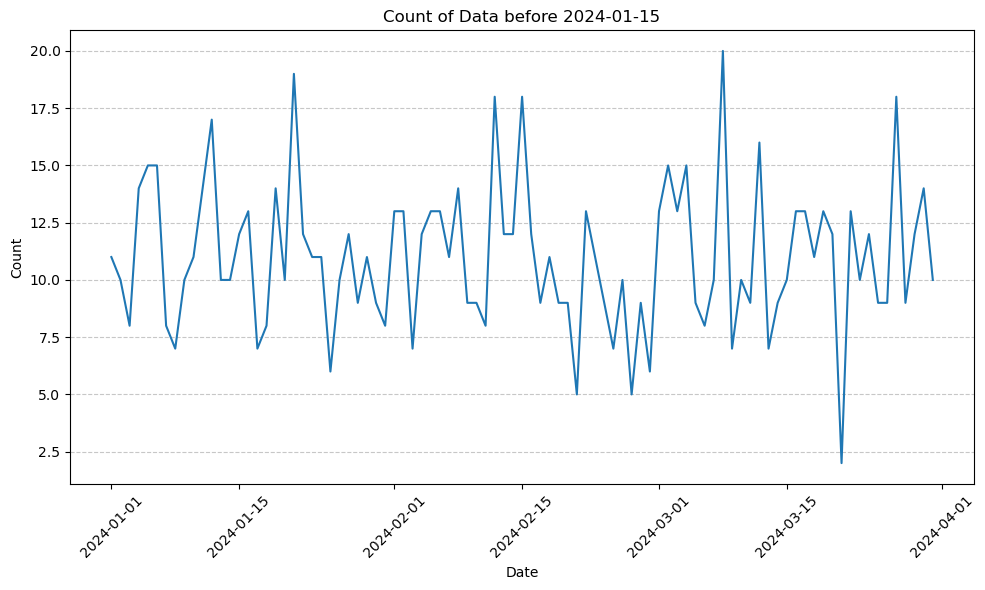

```python
"""
----
layout:single
title:"판다스데이터정제하는법"
---
"""
```


```python
import pandas as pd
import random
from datetime import datetime, timedelta

# 랜덤한 단어 생성을 위한 리스트
words = ['Scaleform', 'AKError', 'EFError']

# 데이터 초기화
data = {
    'funcname': [],
    'date': [],
    'callstack': []
}

# 1000개의 데이터 생성
for _ in range(1000):
    # funcname 생성
    funcname_prefix = random.choice(words)
    funcname_suffix = ''.join(random.choices('1234567890', k=random.randint(0, 1)))  # 5개 이하의 랜덤한 글자
    funcname = funcname_prefix + '_' + funcname_suffix
    
     # date 생성 (2024년 1월 1일부터 4월 1일까지)
    start_date = datetime(2024, 1, 1, 0, 0, 0)
    end_date = datetime(2024, 4, 1, 0, 0, 0)
    random_time = random.random() * (end_date - start_date).total_seconds()
    new_date = start_date + timedelta(seconds=random_time)
    date_str = new_date.strftime('%Y-%m-%d %H:%M:%S')
    # callstack 생성
    callstack = random.randint(0, 1000)
    
    # 데이터에 추가
    data['funcname'].append(funcname)
    data['date'].append(date_str)
    data['callstack'].append(callstack)

# 데이터프레임 생성
df = pd.DataFrame(data)
```


```python
copy_df = df.copy()
copy_df
```


<div>
<style scoped>
    .dataframe tbody tr th:only-of-type {
        vertical-align: middle;
    }

    .dataframe tbody tr th {
        vertical-align: top;
    }

    .dataframe thead th {
        text-align: right;
    }
</style>
<table border="1" class="dataframe">
  <thead>
    <tr style="text-align: right;">
      <th></th>
      <th>funcname</th>
      <th>date</th>
      <th>callstack</th>
    </tr>
  </thead>
  <tbody>
    <tr>
      <th>0</th>
      <td>Scaleform_</td>
      <td>2024-03-14 18:51:00</td>
      <td>166</td>
    </tr>
    <tr>
      <th>1</th>
      <td>EFError_</td>
      <td>2024-02-22 08:43:27</td>
      <td>715</td>
    </tr>
    <tr>
      <th>2</th>
      <td>AKError_</td>
      <td>2024-01-29 06:41:58</td>
      <td>416</td>
    </tr>
    <tr>
      <th>3</th>
      <td>Scaleform_2</td>
      <td>2024-01-11 05:02:43</td>
      <td>467</td>
    </tr>
    <tr>
      <th>4</th>
      <td>EFError_6</td>
      <td>2024-02-22 15:38:23</td>
      <td>264</td>
    </tr>
    <tr>
      <th>...</th>
      <td>...</td>
      <td>...</td>
      <td>...</td>
    </tr>
    <tr>
      <th>995</th>
      <td>Scaleform_9</td>
      <td>2024-03-16 07:06:15</td>
      <td>564</td>
    </tr>
    <tr>
      <th>996</th>
      <td>EFError_4</td>
      <td>2024-03-08 16:46:48</td>
      <td>373</td>
    </tr>
    <tr>
      <th>997</th>
      <td>Scaleform_9</td>
      <td>2024-02-23 03:10:01</td>
      <td>376</td>
    </tr>
    <tr>
      <th>998</th>
      <td>EFError_1</td>
      <td>2024-02-08 03:36:24</td>
      <td>909</td>
    </tr>
    <tr>
      <th>999</th>
      <td>AKError_5</td>
      <td>2024-03-20 03:05:11</td>
      <td>74</td>
    </tr>
  </tbody>
</table>
<p>1000 rows × 3 columns</p>
</div>


```python
copy_df["date"] = pd.to_datetime(copy_df["date"])
```


```python
copy_df
```


<div>
<style scoped>
    .dataframe tbody tr th:only-of-type {
        vertical-align: middle;
    }

    .dataframe tbody tr th {
        vertical-align: top;
    }

    .dataframe thead th {
        text-align: right;
    }
</style>
<table border="1" class="dataframe">
  <thead>
    <tr style="text-align: right;">
      <th></th>
      <th>funcname</th>
      <th>date</th>
      <th>callstack</th>
    </tr>
  </thead>
  <tbody>
    <tr>
      <th>0</th>
      <td>Scaleform_</td>
      <td>2024-03-14 18:51:00</td>
      <td>166</td>
    </tr>
    <tr>
      <th>1</th>
      <td>EFError_</td>
      <td>2024-02-22 08:43:27</td>
      <td>715</td>
    </tr>
    <tr>
      <th>2</th>
      <td>AKError_</td>
      <td>2024-01-29 06:41:58</td>
      <td>416</td>
    </tr>
    <tr>
      <th>3</th>
      <td>Scaleform_2</td>
      <td>2024-01-11 05:02:43</td>
      <td>467</td>
    </tr>
    <tr>
      <th>4</th>
      <td>EFError_6</td>
      <td>2024-02-22 15:38:23</td>
      <td>264</td>
    </tr>
    <tr>
      <th>...</th>
      <td>...</td>
      <td>...</td>
      <td>...</td>
    </tr>
    <tr>
      <th>995</th>
      <td>Scaleform_9</td>
      <td>2024-03-16 07:06:15</td>
      <td>564</td>
    </tr>
    <tr>
      <th>996</th>
      <td>EFError_4</td>
      <td>2024-03-08 16:46:48</td>
      <td>373</td>
    </tr>
    <tr>
      <th>997</th>
      <td>Scaleform_9</td>
      <td>2024-02-23 03:10:01</td>
      <td>376</td>
    </tr>
    <tr>
      <th>998</th>
      <td>EFError_1</td>
      <td>2024-02-08 03:36:24</td>
      <td>909</td>
    </tr>
    <tr>
      <th>999</th>
      <td>AKError_5</td>
      <td>2024-03-20 03:05:11</td>
      <td>74</td>
    </tr>
  </tbody>
</table>
<p>1000 rows × 3 columns</p>
</div>


```python
df_sorted = copy_df.sort_values(by='date')
```


```python
df_sorted
```


<div>
<style scoped>
    .dataframe tbody tr th:only-of-type {
        vertical-align: middle;
    }

    .dataframe tbody tr th {
        vertical-align: top;
    }

    .dataframe thead th {
        text-align: right;
    }
</style>
<table border="1" class="dataframe">
  <thead>
    <tr style="text-align: right;">
      <th></th>
      <th>funcname</th>
      <th>date</th>
      <th>callstack</th>
    </tr>
  </thead>
  <tbody>
    <tr>
      <th>268</th>
      <td>EFError_2</td>
      <td>2024-01-01 03:44:48</td>
      <td>432</td>
    </tr>
    <tr>
      <th>809</th>
      <td>EFError_</td>
      <td>2024-01-01 04:40:37</td>
      <td>441</td>
    </tr>
    <tr>
      <th>426</th>
      <td>AKError_</td>
      <td>2024-01-01 04:51:11</td>
      <td>328</td>
    </tr>
    <tr>
      <th>970</th>
      <td>Scaleform_4</td>
      <td>2024-01-01 05:53:16</td>
      <td>465</td>
    </tr>
    <tr>
      <th>622</th>
      <td>AKError_4</td>
      <td>2024-01-01 10:00:40</td>
      <td>37</td>
    </tr>
    <tr>
      <th>...</th>
      <td>...</td>
      <td>...</td>
      <td>...</td>
    </tr>
    <tr>
      <th>597</th>
      <td>AKError_9</td>
      <td>2024-03-31 16:45:26</td>
      <td>110</td>
    </tr>
    <tr>
      <th>630</th>
      <td>Scaleform_3</td>
      <td>2024-03-31 17:48:37</td>
      <td>74</td>
    </tr>
    <tr>
      <th>709</th>
      <td>Scaleform_4</td>
      <td>2024-03-31 20:05:10</td>
      <td>5</td>
    </tr>
    <tr>
      <th>875</th>
      <td>AKError_3</td>
      <td>2024-03-31 21:27:17</td>
      <td>558</td>
    </tr>
    <tr>
      <th>800</th>
      <td>AKError_7</td>
      <td>2024-03-31 22:53:24</td>
      <td>86</td>
    </tr>
  </tbody>
</table>
<p>1000 rows × 3 columns</p>
</div>


```python
# date 컬럼을 기준으로 카운트
df_count = df_sorted.groupby(df_sorted['date'].dt.date).size().reset_index(name='count')
```


```python
df_count
```


<div>
<style scoped>
    .dataframe tbody tr th:only-of-type {
        vertical-align: middle;
    }

    .dataframe tbody tr th {
        vertical-align: top;
    }

    .dataframe thead th {
        text-align: right;
    }
</style>
<table border="1" class="dataframe">
  <thead>
    <tr style="text-align: right;">
      <th></th>
      <th>date</th>
      <th>count</th>
    </tr>
  </thead>
  <tbody>
    <tr>
      <th>0</th>
      <td>2024-01-01</td>
      <td>11</td>
    </tr>
    <tr>
      <th>1</th>
      <td>2024-01-02</td>
      <td>10</td>
    </tr>
    <tr>
      <th>2</th>
      <td>2024-01-03</td>
      <td>8</td>
    </tr>
    <tr>
      <th>3</th>
      <td>2024-01-04</td>
      <td>14</td>
    </tr>
    <tr>
      <th>4</th>
      <td>2024-01-05</td>
      <td>15</td>
    </tr>
    <tr>
      <th>...</th>
      <td>...</td>
      <td>...</td>
    </tr>
    <tr>
      <th>86</th>
      <td>2024-03-27</td>
      <td>18</td>
    </tr>
    <tr>
      <th>87</th>
      <td>2024-03-28</td>
      <td>9</td>
    </tr>
    <tr>
      <th>88</th>
      <td>2024-03-29</td>
      <td>12</td>
    </tr>
    <tr>
      <th>89</th>
      <td>2024-03-30</td>
      <td>14</td>
    </tr>
    <tr>
      <th>90</th>
      <td>2024-03-31</td>
      <td>10</td>
    </tr>
  </tbody>
</table>
<p>91 rows × 2 columns</p>
</div>


```python
df_count[df_count["count"]>30]
```


<div>
<style scoped>
    .dataframe tbody tr th:only-of-type {
        vertical-align: middle;
    }

    .dataframe tbody tr th {
        vertical-align: top;
    }

    .dataframe thead th {
        text-align: right;
    }
</style>
<table border="1" class="dataframe">
  <thead>
    <tr style="text-align: right;">
      <th></th>
      <th>date</th>
      <th>count</th>
    </tr>
  </thead>
  <tbody>
  </tbody>
</table>
</div>


```python
# '2024-01-15' 이하의 데이터 검색
target_date = pd.to_datetime('2024-01-02')
filtered_df = df_count[df_count['date'] <= target_date]
filtered_df
```

    C:\Users\kimjaehee\anaconda3\lib\site-packages\pandas\core\ops\array_ops.py:73: FutureWarning: Comparison of Timestamp with datetime.date is deprecated in order to match the standard library behavior. In a future version these will be considered non-comparable. Use 'ts == pd.Timestamp(date)' or 'ts.date() == date' instead.
      result = libops.scalar_compare(x.ravel(), y, op)
    


<div>
<style scoped>
    .dataframe tbody tr th:only-of-type {
        vertical-align: middle;
    }

    .dataframe tbody tr th {
        vertical-align: top;
    }

    .dataframe thead th {
        text-align: right;
    }
</style>
<table border="1" class="dataframe">
  <thead>
    <tr style="text-align: right;">
      <th></th>
      <th>date</th>
      <th>count</th>
    </tr>
  </thead>
  <tbody>
    <tr>
      <th>0</th>
      <td>2024-01-01</td>
      <td>11</td>
    </tr>
    <tr>
      <th>1</th>
      <td>2024-01-02</td>
      <td>10</td>
    </tr>
  </tbody>
</table>
</div>


```python
import matplotlib.pyplot as plt
# 시각화
plt.figure(figsize=(10, 6))
#df_count['date'].hist(bins=20, color='skyblue', alpha=0.7)
plt.plot(df_count["date"], df_count["count"])
plt.title('Count of Data before 2024-01-15')
plt.xlabel('Date')
plt.ylabel('Count')
plt.xticks(rotation=45)
plt.grid(axis='y', linestyle='--', alpha=0.7)
plt.tight_layout()
plt.show()
```


    

    

